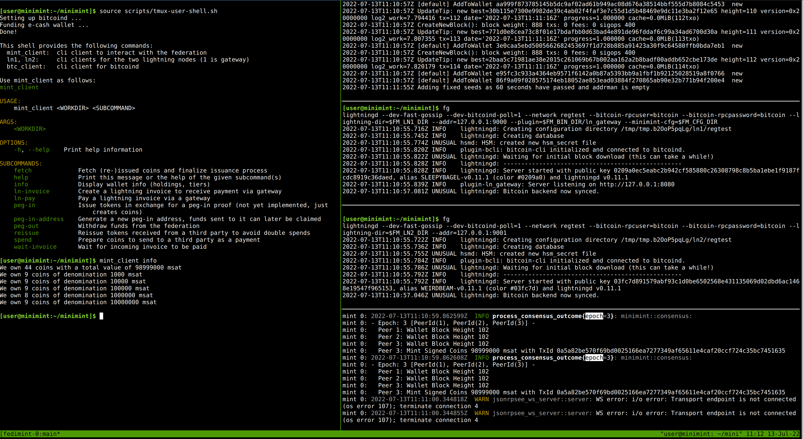

# MiniMint

MiniMint is a federated [Chaumian e-cash](https://en.wikipedia.org/wiki/Ecash) mint backed by bitcoin with deposits and withdrawals that can occur on-chain or via Lightning.

**DO NOT USE IT WITH REAL MONEY, THERE ARE MULTIPLE KNOWN SECURITY ISSUES.**

## Getting involved

If you want to learn more about the general idea go to [fedimint.org](https://fedimint.org/), beyond a high level explanation you can also find links to talks and blog posts at the bottom of the page.

Visit our [Telegram group](https://t.me/fedimint) for high-level discussions (no codebase questions please).

To get started with development have a look at the:
* [Developer discord](https://discord.gg/dZYajBMsEB) - only for programming questions and discussing the codebase
* [GitHub Issues](https://github.com/fedimint/minimint/issues) - things to fix, planned features, longer term architectural choices, etc.
* [Architecture](docs/architecture.md) - high-level description of the codebase and design
* [Integration tests](integrationtests/README.md) - instructions on how to write and run the integration tests
* [Scripts](scripts/README.md) - useful scripts for running the tests and federation

PRs fixing TODOs or issues are always welcome, but please discuss more involved changes in an issue first. Smaller PRs to fix typos, broken links etc. are also very welcome.
Happy hacking!

## Running MiniMint
MiniMint consists of three kinds of executables:
* **Federation nodes** - servers who form the mint by running a consensus protocol
* **Lightning gateways** - allows users send and receive over Lightning by bridging between the mint and an LN node
* **User clients** - handles user communication with the mint and the gateway

### Prerequisites
In order to run MiniMint you will need:
- The [Rust toolchain](https://www.rust-lang.org/tools/install) to build and run the executables
- The [Nix package manager](https://nixos.org/download.html) for managing build and test dependencies

Clone and `cd` into the MiniMint repo:
```shell
git clone git@github.com:fedimint/minimint.git
cd minimint
```

### Setting up the federation
Just run the following script
```shell
./scripts/tmuxinator.sh
```
which will set up a complete federation including a lightning gateway and another lightning node inside tmux. The first run can take some time since a lot of dependencies need to be built.

The first tmux screen is one big shell for you to follow the tutorial in. If you want to see the federation, bitcoind and lightningd running you can navigate to the second screen (shown below) by typing `ctrl+b, n` (next) and `ctrl+b, p` (previous). You can scroll through the terminal buffer by first typing `ctrl+b, PgUp` and then navigating using `PgUp` and `PgDown`. To maximize any of the panes type `ctrl+b, z`.



### Using the client
Note as you run commands the mint nodes will output logging information which you can adjust by setting the [RUST_LOG](https://docs.rs/env_logger/latest/env_logger/) env variable.

The previous step has already set up an e-cash client with a funded wallet for you. If you are interested in the details take a look at [`scripts/pegin.sh`](scripts/pegin.sh).

You can view your client's holdings using the `info` command:

```shell
$ mint_client info

INFO mint_client_cli: We own 18 coins with a total value of 99000000 msat
INFO mint_client_cli: We own 9 coins of denomination 1000000 msat
INFO mint_client_cli: We own 9 coins of denomination 10000000 msat
```

The `spend` subcommand allows sending tokens to another client. This will select the smallest possible set of the client's coins that represents a given amount. The coins are base64 encoded and printed to stdout.

```shell
$ mint_client spend 400000

AQAAAAAAAABAQg8AAA...
```

A receiving client can now reissue these coins to claim them and avoid double spends:

```shell
$ mint_client reissue AQAAAAAAAABAQg8AAA...
$ mint_client fetch

INFO mint_client_cli: Fetched coins issuance=5b1ac4e9604...
```

### Using the gateway

First let's have the gateway execute a peg-in so it has an ecash token balance. We can use the same `pegin.sh` script as before, but add an extra parameter to tell it to use the gateway:

```shell
$ ./scripts/pegin.sh 0.0001 1
```

Now we can use `lightning-cli` of the node where the gateway plugin is running to get our ecash token balance:

```shell
$ ln1 gw-balance
{
   "balance_msat": 9000000
}
```

To make an outgoing payment we generate a Lightning invoice from LN2, our non-gateway lightning node:

```shell
$ ln2 invoice 100000 test test 1m

{
   "bolt11": "lnbcrt1u1p3vdl3ds...",
   ...
}
```

Pay the invoice by copying the `bolt11` invoice field:

```shell
$ mint_client ln-pay "lnbcrt1u1p3vdl3ds..."
```

Confirm the invoice was paid

```shell
$ ln2 listinvoices test

{
   "invoices": [
      {
         "label": "test",
         "status": "paid",
         ...
      }
   ]
}
```

Create our own invoice:
```shell
$ mint_client ln-invoice 1000 "description"
lnbcrt1u1p3vcp...
```

Have `ln2` pay it:

```shell
$ ln2 pay lnbcrt1u1p3vcp...
```

Have mint client check that payment succeeded, fetch coins, and display new balances:

```shell
$ mint_client wait-invoice lnbcrt1u1p3vcp... 
$ mint_client fetch
$ mint_client info
```

### Other options

There also exist some other, more experimental commands that can be explored using the `--help` flag:

```shell
$ mint_client help

mint-client-cli 

USAGE:
    mint-client-cli <WORKDIR> <SUBCOMMAND>

ARGS:
    <WORKDIR>    

OPTIONS:
    -h, --help    Print help information

SUBCOMMANDS:
    fetch             Fetch (re-)issued coins and finalize issuance process
    help              Print this message or the help of the given subcommand(s)
    info              Display wallet info (holdings, tiers)
    ln-pay            Pay a lightning invoice via a gateway
    ln-invoice        Create a lightning invoice to receive payment via gateway
    peg-in            Issue tokens in exchange for a peg-in proof (not yet implemented, just
                          creates coins)
    peg-in-address    Generate a new peg-in address, funds sent to it can later be claimed
    peg-out           Withdraw funds from the federation
    reissue           Reissue tokens received from a third party to avoid double spends
    spend             Prepare coins to send to a third party as a payment
    wait-invoice      Wait for incoming invoice to be paid
```

# Contributing

Contributions are very welcome, just open an issue or PR if you see something to improve! See our other [communication channels](#getting-involved) above to coordinate with other contributors!

Please note that all contributions happen under the MIT license as described below:

```
Developer Certificate of Origin
Version 1.1

Copyright (C) 2004, 2006 The Linux Foundation and its contributors.

Everyone is permitted to copy and distribute verbatim copies of this
license document, but changing it is not allowed.


Developer's Certificate of Origin 1.1

By making a contribution to this project, I certify that:

(a) The contribution was created in whole or in part by me and I
    have the right to submit it under the open source license
    indicated in the file; or

(b) The contribution is based upon previous work that, to the best
    of my knowledge, is covered under an appropriate open source
    license and I have the right under that license to submit that
    work with modifications, whether created in whole or in part
    by me, under the same open source license (unless I am
    permitted to submit under a different license), as indicated
    in the file; or

(c) The contribution was provided directly to me by some other
    person who certified (a), (b) or (c) and I have not modified
    it.

(d) I understand and agree that this project and the contribution
    are public and that a record of the contribution (including all
    personal information I submit with it, including my sign-off) is
    maintained indefinitely and may be redistributed consistent with
    this project or the open source license(s) involved.
```
