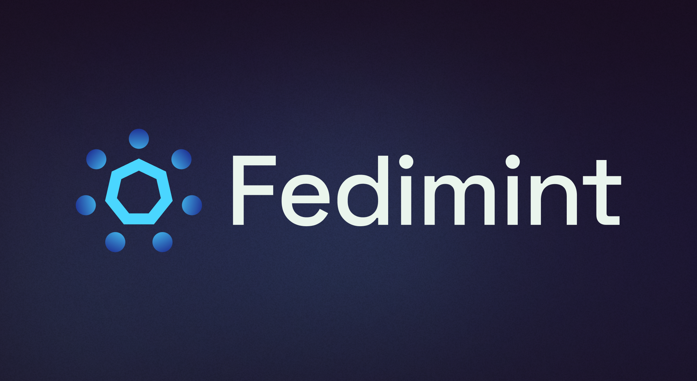

<h1 align="center">
  <a href="https://fedimint.org">
    Fedimint
  </a>
</h1>

<p align="center">
    
</p>

<p align="center">
  <a href="https://github.com/fedimint/fedimint/actions/workflows/ci-nix.yml">
      
  </a>
  <a href="https://chat.fedimint.org"></a>
  <a href="https://github.com/fedimint/fedimint/discussions">
    
  </a>
  
</p>

[Fedimint](https://fedimint.org) is a module based system for building federated applications. It is designed to be a trust-minimized, censorship-resistant, and private alternative to centralized applications.

> **Fedimint is alpha software released under an [MIT License](https://github.com/fedimint/fedimint/blob/master/LICENSE) and recently cut its 0.1 release. We recommend you run Fedimint on testnets like mutinynet, or on mainnet with small amounts of money.**

Fedimint ships with 3 default modules: [Bitcoin](https://github.com/bitcoin/bitcoin), [Lightning](https://github.com/lightning/bolts), and [Chaumian Ecash](https://en.wikipedia.org/wiki/Ecash), for out-of-the-box best practices for private and trust-minimized payments. [You can write custom modules](https://github.com/fedimint/fedimint-custom-modules-example) that define further consensus items and transaction types leveraging the payments modules to build your own federated applications.

The Fedimint Developer Discord is the best place to get help and ask questions. [Join the Discord](https://discord.gg/cEVEmqCgWG) and say hi! We are extremely active and work to onboard developers or all skill levels to Fedimint and associated open-source Bitcoin projects. Fedimint touches many different areas of Bitcoin development, so there is something for everyone. See below for more information on how to get involved.

## Running your own Fedimint

It's easy to set up and run your own federations. Fedimint is designed to be [Byzantine Fault Tolerant](https://bitcoinmagazine.com/glossary/what-is-the-byzantine-generals-problem) so is resilient to `m` malicious nodes in a federation of `3m + 1` nodes. If you run a federation of 4 guardians you are resilient to 1 malicious guardian, if you run a federation of 7 guardians you are resilient to 2 guardians, etc.

[Fedimint's 0.1 release](https://github.com/fedimint/fedimint/releases/tag/v0.1.3) can also be run with smaller configurations (1/1, 2/2, 2/3) for testing and development.

To do lightning payments, Fedimint requires a [Lightning Gateway](https://github.com/fedimint/fedimint/blob/master/docs/gateway.md): a user of the federation that accepts ecash in exchange for sending/receiving lightning payments. The Lightning Gateway is not a guardian and acts as an untrusted economic actor serving the federation.

### Running Fedimint on Mutinynet

The easiest way to run Fedimint on the Mutinynet testnet is with Clovyr, a decentralized application platform. Click the Launch buttons below to spin up a Fedimint guardian or Lightning Gateway in a couple minutes. Clovyr handles hosting, DNS, and configuration for you.

- [Launch Fedimint Guardian](https://clovyr.app/apps/fedimint-guardian)
- [Launch Lightning Gateway](https://clovyr.app/apps/lightning-gateway)

To run Fedimint on your own hardware or another cloud provider, or to run Fedimint on a different network like mainnet, see the [Fedimint Setup Guide](./docs/setup-docs.md).

## For Developers

We are actively looking for developers to help build Fedimint and associated open-source Bitcoin projects. Fedimint touches many different areas of Bitcoin development, so there is something for everyone. The best places to get started are:

- [The Fedimint Developer Discord](https://discord.gg/cEVEmqCgWG): the best place to get help and ask questions.
- [Fedimint Contributor Calendar](https://calendar.google.com/calendar/u/0/embed?src=fedimintcalendar@gmail.com): This calendar contains all the developer calls and events.
- [Fedimint Developer Calls](https://meet.jit.si/fedimintdevcall): We have developer calls every monday at 4PM UTC to review PRs and discuss current development priorities. As a new developer, this is a great place to find good first issues and mentorship from the core team on how to get started contributing to Fedimint.
- [Weekly Deep Dive](https://meet.jit.si/fedimintdevcall): We have a deep dive every thursday at 4PM UTC to discuss technical topics relating to Fedimint in depth: cryptography, Rust programming, consensus, networking, etc. This is a great place to learn about the internals of Fedimint and Bitcoin. We normally plan these calls based off requests from contributors on aspects of Fedimint they want to learn more about, so please reach out if you have a topic you want to learn more about.
- [UI/UX Design Calls](https://meet.jit.si/fedimintdevcall): We have UI/UX design calls every wednesday at 4PM UTC to discuss the UI/UX of Fedimint and associated projects. This is a great place to get involved if you are a UI/UX designer or developer with React/Typescript experience.

### Fedimint Repos and Projects to Contribute To

- [Fedimint](https://github.com/fedimint/fedimint/issues?q=is%3Aissue+is%3Aopen+label%3A%22good+first+issue%22): The core Fedimint repository. This is where the core consensus and networking code lives. Fedimint is an advanced Rust project and is a great place to learn Rust, cryptography, networking, consensus, and bitcoin development. We have a lot of good first issues, are happy to mentor new developers, and are always looking for experienced Rust developers to help with the core codebase.
- [UI](https://github.com/fedimint/ui): The default Fedimint Guardian and Lightning Gateway UIs. These are Typescript and React projects. Contributing to this repo helps with UI/UX design and development to make Fedimint more user friendly.
- [Lightning Gateway](https://github.com/fedimint/fedimint/issues?q=is%3Aissue+is%3Aopen+label%3Alightning): Fedimint's Lightning Gateway is implemented as an HTLC interceptor and currently works with CLN, LND, and LDK's sample-node implementations. We are always looking for lightning developers to help with the Lightning Gateway, especially around improving payment reliability and to add support for more lightning implementations.
- [Custom Modules](https://github.com/fedimint/fedimint-custom-modules-example): Fedimint ships with 3 default modules: Bitcoin, Lightning, and Chaumian Ecash. You can write custom modules that define further consensus items and transaction types leveraging the payments modules to build your own federated applications. We are always looking for developers to help build custom modules and to help improve the module system.

## Spinning up the Fedimint Developer Environment

Fedimint is a Rust project and uses the [Nix package manager](https://nixos.org/) to manage dependencies and build the project. You can spin up a Clovyr developer environment (in-browser VSCode with preconfigured Nix, Rust, and Fedimint) through [Clovyr Instant](https://clovyr.app/instant/code-fedimint) or you can install Nix and clone the Fedimint repo to get started.

### Local Development

Fedimint's developer environment and rust build pipeline is managed through Nix flakebox (https://github.com/rustshop/flakebox). To get started, install Nix.

```bash
sh <(curl -L https://nixos.org/nix/install) --daemon
```

Then fork and clone the Fedimint repo.

```bash
git clone https://github.com/your-username/fedimint.git
```

Then enter the nix developer environment.

```bash
nix develop
```

and start a local regtest network with 4 guardians and a lightning gateway.

```bash
just mprocs
```

You can then interact with the guardians and lightning gateway through the mprocs cli.

If you want to run with UIs, see the [UI](https://github.com/fedimint/ui) repo for developer environment instructions.
