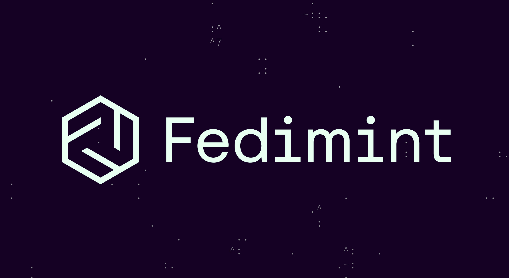

<h1 align="center">
  <a href="https://fedimint.org">
    Fedimint
  </a>
</h1>

    

  
  
  
  

Fedimint is a federated [Chaumian e-cash](https://en.wikipedia.org/wiki/Ecash) mint backed by bitcoin with deposits and withdrawals that can occur on-chain or via Lightning.

Fedimint is alpha software. Use cautiously, with small amounts of money. There are still multiple known privacy issues.

* <a id="community" />Community:
  * [Telegram group](https://t.me/fedimint) for high-level non-technical discussion
  * [Developer discord](https://chat.fedimint.org) for technical discussion
* For developers:
  * [Introduction for contributors](./docs/contributing.md)
  * [Setting up dev environment](./docs/dev-env.md)
  * [Running Fedimint for dev testing](./docs/dev-running.md)
  * [Developer calls on Monday & Thursday](https://calendar.google.com/calendar/u/0/embed?src=fedimintcalendar@gmail.com)
