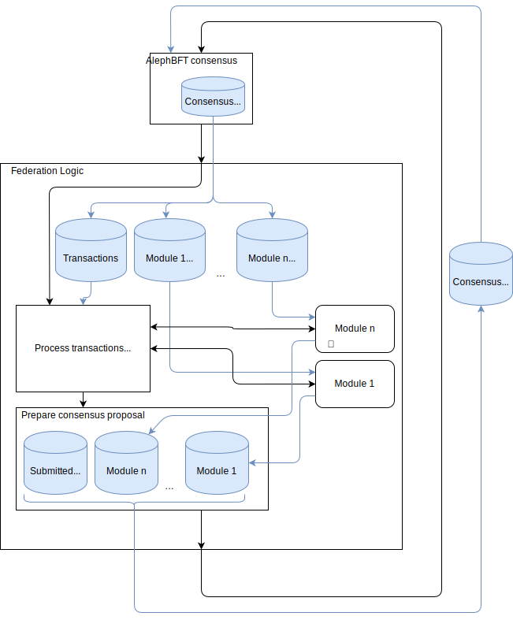

# Fedimint Architecture

Fedimint is a general framework for building federated financial applications.

The current implementation allows users to make private and low-cost payments through a federated blinded mint that issues [e-cash](https://en.wikipedia.org/wiki/Ecash).
All e-cash is backed by bitcoin with deposits and withdrawals that can occur on-chain or via Lightning.

## Crate organization
The [Fedimint federation](#Federation-Nodes) consists of nodes that are primarily built from the following crates:
* `fedimint` - the main consensus code for processing transactions and REST API
* `fedimint-api` - the common serialization and database representations for communication between crates
* `fedimint-derive` - helper macros for serialization
* `crypto/tbs` - helper cryptography library for threshold blind signatures
* `integrationtests/fedimint-tests` - integration testing framework

[Modules](#Modules) can be added to the `FedimintConsensus` to allow for new types of transactions and federated actions:
* `modules/fedimint-wallet` - an on-chain bitcoin wallet
* `modules/fedimint-mint` - a blinded mint that issues e-cash
* `modules/fedimint-ln` - a Lightning payment service

* `fedimint-core` - common code used by both client and server. Can't be in `fedimint-api` because it depends on modules

The [user client](#User-Client):
* `client/client-lib` - provides a library for sending transactions to the federation
* `client/cli` - cli wrapper around the client library

The [LN gateway](#LN-Gateway):
* `ln-gateway` - allows a Lightning node operator to receive or pay Lightning invoices on behalf of users

## Federation Nodes
Each of the nodes spawns three long-running tasks in parallel: an API task, a [HBBFT protocol](https://docs.rs/hbbft/latest/hbbft/) task, and a Fedimint consensus task.

The API task in `net:api:run_server` allows clients to submit a `Transaction` and retrieve the `TransactionStatus`.
Transactions are validated by the `FedimintConsensus` logic before being stored as proposals in the database.
The proposed list of `ConsensusItem` includes all possible consensus state changes, such as mint transactions or updates to the agreed-upon block height.

The HBBFT protocol task handles communication between federation nodes, combining different `ConsensusItem` proposals from each node into an identical `ConsensusOutcome` during an epoch.
So long as enough nodes can communicate, epochs will be continually generated, and every node will share the same sequence of `ConsensusOutcome` data.

The `FedimintConsensus` task processes each `ConsensusOutcome` by validating the proposals, updating the database, and performing any necessary actions.
For instance, the consensus thread may receive a peg-out proposal, validate the PSBT signature and transaction balances, then sign and submit the transaction to the Bitcoin network.

## Modules
There currently are three `FederationModule` used in `FedimintConsensus` that exist in the [crates](#Crate-organization) previously described:
* [Wallet module](wallet_module.md) - handles bitcoin on-chain `PegInProof` inputs and `PegOut` outputs
* `Mint` module - verifies `Note` input signatures and issues `BlindToken` outputs of different denominations
* `LightningModule` - creates `ContractInput` inputs and `ContractOrOfferOutput` outputs representing a payment sent or received by a gateway on behalf of a user

Any module can contribute inputs and outputs in the same `Transaction`.
For instance, if users wish to convert on-chain bitcoin to Fedimint tokens they can create a transaction with `PegInProof` inputs from `modules/fedimint-wallet`  and `BlindToken` outputs from `modules/fedimint-mint`.

In the future other modules can be added, for instance to enable smart contracts or even a federated marketplace.
Existing `ConsensusItem` representations are documented in the [database schema](database.md).

A diagram of the module transaction processing:

## User Client
The `UserClient` communicates with federation members via an asynchronous REST API.
Clients are expected to communicate with as many members as necessary to overcome malicious federation nodes.
Requests are delegated to an underlying `LnClient`, `MintClient`, or `WalletClient` depending on what `FederationModule` the client needs to perform an action.

A submitted `Transaction` often requires multiple epochs to become spendable, usually because they require signatures from a quorum of federation members.
Clients query for the `TransactionStatus` by unique `OutPoint` that includes the `TransactionId`.

After enough epochs have passed, the `TransactionStatus` contain either return an `Error` message or the `OutputOutcome` indicating how the inputs were spent and possibly returning data to the user such as blind-signed tokens.

## LN Gateway
The `LnGateway` communicates with a local Lightning node in order to provide an API that can pay invoices.
The gateway uses a `GatewayClient` to communicate with the federation, which delegates to the same underlying `LnClient` or `MintClient` used by the `UserClient`.

When a user submits a pay invoice request, the gateway uses the `GatewayClient` to confirm the user has locked funds into a valid `ContractAccount`.
The gateway then pays the LN invoice and provides the preimage to the federation as proof the payment succeeded, at which point the federation will release the funds to the gateway.

Read [more about the lightning gateway](./gateway.md)
