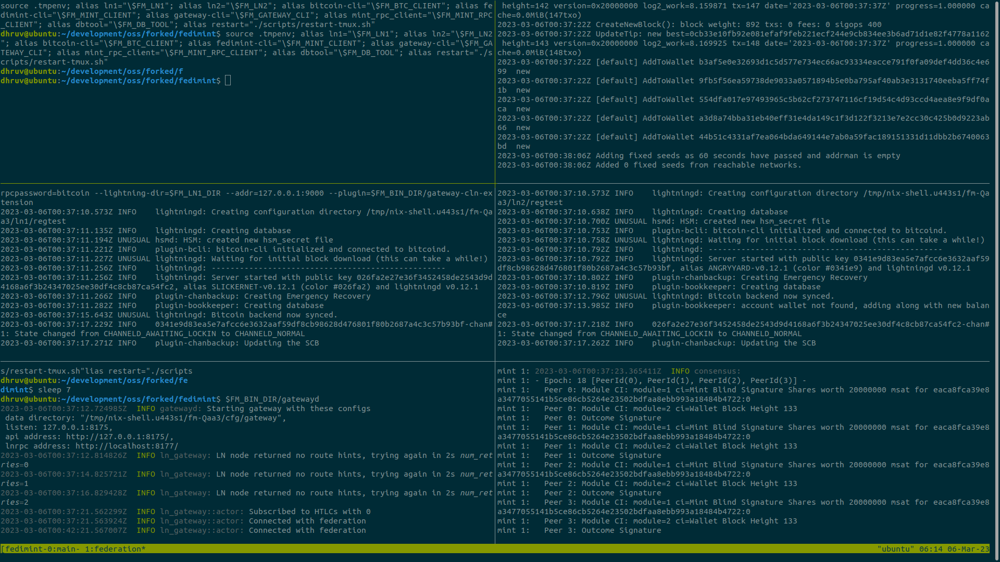

## Running Fedimint for dev testing

Fedimint consists of three kinds of executables:

* **Federation nodes** - servers who form the mint by running a consensus protocol
* **Lightning gateways** - allows users send and receive over Lightning by bridging between the mint and an LN node
* **User clients** - handles user communication with the mint and the gateway

### Prerequisites

In order to run Fedimint you will need:
- The [Rust toolchain](https://www.rust-lang.org/tools/install) to build and run the executables
- The [Nix package manager](https://nixos.org/download.html) for managing build and test dependencies

Clone and `cd` into the Fedimint repo:

```shell
git clone git@github.com:fedimint/fedimint.git
cd fedimint
```

It's recommended to **start all the commands in "Nix dev shell"**, which can be started with `nix develop` command.

### Setting up the federation

Just run the following script, **make sure not to run it inside a tmux window**:

```shell
./scripts/tmuxinator.sh
```
which will set up a complete federation including a lightning gateway and another lightning node inside tmux. The first run can take some time since a lot of dependencies need to be built.

The first tmux screen is one big shell for you to follow the tutorial in. If you want to see the federation, bitcoind and lightningd running you can navigate to the second screen (shown below) by typing `ctrl+b, n` (next) and `ctrl+b, p` (previous). You can scroll through the terminal buffer by first typing `ctrl+b, PgUp` and then navigating using `PgUp` and `PgDown`. To maximize any of the panes type `ctrl+b, z`. 
To end the whole tmuxinator session and terminate all the services which were started type `ctrl+b, :kill-session` and hit `Enter`.



### Using the client

Note as you run commands the mint nodes will output logging information which you can adjust by setting the [RUST_LOG](https://docs.rs/env_logger/latest/env_logger/) env variable.

The previous step has already set up an e-cash client with a funded wallet for you. If you are interested in the details take a look at [`scripts/pegin.sh`](../scripts/pegin.sh).

You can view your client's holdings using the `info` command:

```shell
$ fedimint-cli info

{
  "federation_id": "b0d8dc13caff84c3e050a891c06966abfc55874b8173e3523eea323b827e6754270bb975b8693081b903a319c2d33591",
  "network": "regtest",
  "meta": {
    "federation_name": "Hals_trusty_mint"
  },
  "total_amount": 10000000,
  "total_num_notes": 52,
  "details": {
    "1": 2,
    "2": 3,
    ...
  }
}
```

The `spend` subcommand allows sending notes to another client. This will select the smallest possible set of the client's notes that represents a given amount.
The notes are base64 encoded into a note and printed as the `note` field.

```shell
$ fedimint-cli spend 100000

{
  "note": "BgAAAAAAAAAgAAAAAAAAAAEAAAAAAAAAwdt..."
}
```

The `validate` subcommand checks the validity of the signatures without claiming the notes. It does not check if the nonce is unspent. Validity will be printed as the `all_valid` boolean.

```shell
$ fedimint-cli validate BgAAAAAAAAAgAAAAAAAAAAEAAAAAAAAAwdt...

{
  "all_valid": true,
  "details": {
    "32": 1,
    "128": 1,
    "512": 1,
    ...
  }
}
```

A receiving client can now reissue these notes to claim them and avoid double spends:

```shell
$ fedimint-cli reissue BgAAAAAAAAAgAAAAAAAAAAEAAAAAAAAAwdt...

{
  "id": {
    "txid": "9b0ba12ae4295d4c393afee6a0ba7c9b0336ab6243a048265fd837a82a9c9059",
    "out_idx": 0
  }
}

$ fedimint-cli fetch

{
  "issuance": [
    {
      "txid": "9b0ba12ae4295d4c393afee6a0ba7c9b0336ab6243a048265fd837a82a9c9059",
      "out_idx": 0
    }
  ]
}
```

### Using the Gateway

The [lightning gateway](../gateway/ln-gateway) connects the federation to the lightning network. It contains a federation client that holds ecash notes just like `fedimint-cli`. The tmuxinator setup scripts also give it some ecash. To check its balance, run `gateway-cli info`, copy the federation id and then:

```shell
$ gateway-cli balance <FEDERATION-ID>

{
  "balance_msat": 30000000
}
```

Tmuxinator has 2 lightning nodes running. [Core Lightning](https://github.com/ElementsProject/lightning) which is running a gateway, and [LND](https://github.com/lightningnetwork/lnd) which represents an external node that doesn't know about Fedimint. With these two nodes, you can simulate sending into and out of Fedimint via Lightning.

To make an outgoing payment we generate a Lightning invoice from LND, our non-gateway lightning node:

```shell
$ lncli addinvoice --amt_msat 100000

{
   ...
   "r_hash": "1072fe19b3a53b3d778f6d5b0b...",
   "payment_request": "lnbcrt1u1p3vdl3ds...",
   ...
}
```

Pay the invoice by copying the `payment_request` field:

```shell
$ fedimint-cli ln-pay "lnbcrt1u1p3vdl3ds..."
```

Confirm the invoice was paid, copy the `r_hash` field from the `lncli addinvoice` command above:

```shell
$ lncli lookupinvoice 1072fe19b3a53b3d778f6d5b0b...

{
    ...
    "state": "SETTLED",
    ...
}
```

To receive a lightning payment inside use `fedimint-cli` to create an invoice:
```shell
$ fedimint-cli ln-invoice 1000 "description"

{
  "invoice": "lnbcrt10n1pjq2zwxdqjv..."
}
```

Have `lncli` pay it:

```shell
$ lncli payinvoice --force lnbcrt10n1pjq2zwxdqjv...
```

Have mint client check that payment succeeded, fetch notes, and display new balances:

```shell
$ fedimint-cli wait-invoice lnbcrt10n1pjq2zwxdqjv...
$ fedimint-cli fetch
$ fedimint-cli info
```

Read [more about the Gateway here](./gateway.md)

### Other options

There also exist some other, more experimental commands that can be explored using the `--help` flag:

```shell
$ fedimint-cli help

Usage: fedimint-cli --workdir <WORKDIR> <COMMAND>

Commands:
  version-hash         Print the latest git commit hash this bin. was build with
  peg-in-address       Generate a new peg-in address, funds sent to it can later be claimed
  api                  Send direct method call to the API, waiting for all peers to agree on a response
  peg-in               Issue notes in exchange for a peg-in proof
  reissue              Reissue notes received from a third party to avoid double spends
  validate             Validate notes without claiming them (only checks if signatures valid, does not check if nonce unspent)
  spend                Prepare notes to send to a third party as a payment
  peg-out              Withdraw funds from the federation
  ln-pay               Pay a lightning invoice via a gateway
  fetch                Fetch (re-)issued notes and finalize issuance process
  info                 Display wallet info (holdings, tiers)
  ln-invoice           Create a lightning invoice to receive payment via gateway
  wait-invoice         Wait for incoming invoice to be paid
  wait-block-height    Wait for the fed to reach a consensus block height
  decode-connect-info  Decode connection info into its JSON representation
  encode-connect-info  Encode connection info from its constituent parts
  connect-info         Config enabling client to establish websocket connection to federation
  join-federation      Join a federation using it's ConnectInfo
  list-gateways        List registered gateways
  switch-gateway       Switch active gateway
  backup               Upload the (encrypted) snapshot of mint notes to federation
  restore              Restore the previously created backup of mint notes (with `backup` command)
  help                 Print this message or the help of the given subcommand(s)

Options:
      --workdir <WORKDIR>  The working directory of the client containing the config and db
  -h, --help               Print help
  -V, --version            Print version
```
