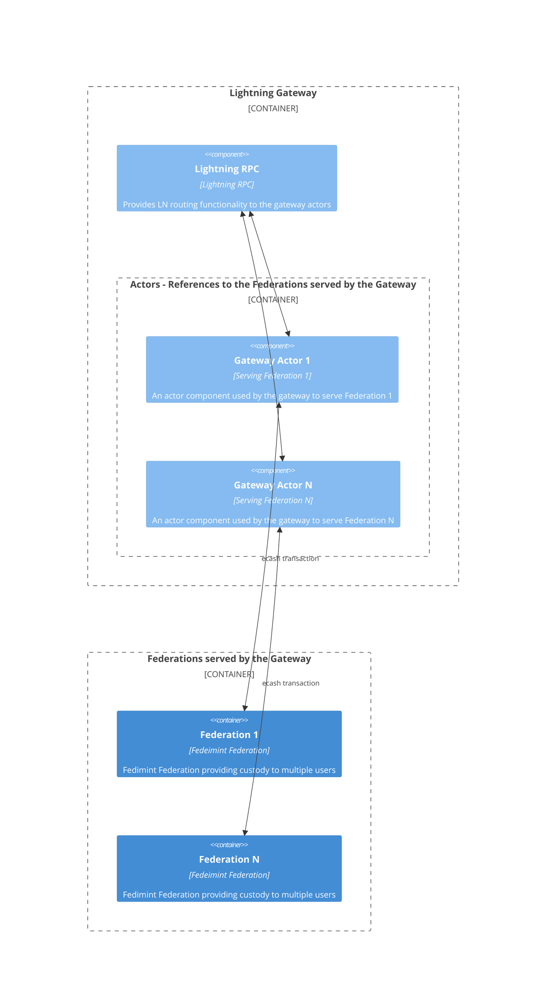

# Fedimint Lightning Gateways

Lightning Gateways provide routing services in and out of Fedimint Federations. In essence, a Gateway is a specialized Fedimint client, paired up with a running instance of lightning node like [CLN](https://github.com/ElementsProject/lightning) or [LND](https://github.com/lightningnetwork/lnd), so it can route payments on behalf of the Federation.

A single Gateway can serve multiple Federations.

## Components

The Gateway consists of:

1. **Lightning RPC** - An RPC client for interacting with a lightning node that routes lightning payments on behalf of the gateway

2. **Gateway Actor** - An abstration over Federation clients. A Gateway actor contains one (and only one) client to a Federation which the gateway serves. A Gateway will have as many actors as the number of Federations it serves, coordinating these actors where necessary in order to route payments between the federations.



## Deploying a Gateway for Local Testing

---

As described in [Running Fedimint for dev testing](./dev-running.md#using-the-gateway), running `./scripts/tmuxinator.sh` starts a local development Federation instance with a running Gateway instance attached. You can interact with this Gateway via `gateway-cli`.

Run `gateway-cli help` to see some of the commands available in managing the gateway:

```shell
$ gateway-cli help

Usage: gateway-cli [OPTIONS] <COMMAND>

Commands:
  generate-config  Ganerate gateway configuration NOTE: This command can only be used on a local gateway
  version-hash     Display CLI version hash
  info             Display high-level information about the Gateway
  balance          Check gateway balance TODO: add federation id to scope the federation for which we want a pegin address
  address          Generate a new peg-in address, funds sent to it can later be claimed
  deposit          Deposit funds into a gateway federation TODO: add federation id to scope the federation for which we want a pegin address
  withdraw         Claim funds from a gateway federation TODO: add federation id to scope the federation for which we want a pegin address
  register-fed     Register federation with the gateway
  help             Print this message or the help of the given subcommand(s)

Options:
  -u, --url <URL>                  The address of the gateway webserver [default: http://localhost:8080]
      --rpcpassword <RPCPASSWORD>  WARNING: Passing in a password from the command line may be less secure!
  -h, --help                       Print help information
  -V, --version                    Print version information
```

## Deploying a Gateway in Production

---

- **TODO!** Add docs here

### Deploy with CLN

- **TODO!** Add docs here

### Deploy with LND

- **TODO!** Add docs here

### Configuration Options

- **TODO!** Add docs here

## Liquidity for a Lightning Gateways

---

- **TODO!** Add docs here

## Register and Serve Federations

---

- **TODO!** Add docs here
