# Fedimint Lightning Gateway

<p align="center">
  
</p>

A Lightning Gateway connects Fedimint federations to the Lightning Network, enabling users to send and receive Lightning payments using their federated ecash. This guide covers what gateways are, how to deploy one, and how to operate it.

---

## What is a Lightning Gateway?

A Lightning Gateway is a service that bridges Fedimint federations with the broader Lightning Network. It enables federation users to:

- **Receive Lightning payments** - The gateway accepts incoming Lightning payments and credits the recipient's federation balance with ecash
- **Send Lightning payments** - The gateway pays Lightning invoices on behalf of users, debiting their ecash balance
- **Route between federations** - A single gateway can serve multiple federations, facilitating payments between them
- **Earn fees** - Gateways earn fees when routing outgoing or incoming payments

<details>
<summary><strong>How It Works</strong></summary>

When a federation user wants to receive a Lightning payment:
1. The user encrypts a preimage and stores it with the federation where they want to receive their ecash.
2. The user requests an invoice from the gateway.
3. The gateway creates a HOLD invoice using its Lightning node and the payment hash of the preimage from the user.
4. When the invoice is paid, the gateway buys the preimage from the federation, crediting the user with ecash.
5. The gateway uses the decrypted preimage to complete the incoming payment.

When a federation user wants to send a Lightning payment:
1. The user locks ecash in a HTLC-contract enforced by the federation and instructs the gateway to pay a Lightning invoice.
2. The gateway pays the invoice using its Lightning node and uses the preimage to claim the ecash locked in the HTLC-contract.
3. The gateway earns a small fee for providing this service.

</details>

<details>
<summary><strong>Key Concepts</strong></summary>

- **Gateway Operator** - The person or entity running the gateway software and Lightning node
- **Federation Balance** - The amount of ecash the gateway holds in each federation it serves
- **Liquidity** - The gateway needs both Lightning liquidity (for routing payments) and ecash liquidity (for crediting users on inbound payments)

</details>

---

## Supported Lightning Backends

The gateway supports two Lightning backends:

<details>
<summary><strong>LDK (Integrated)</strong></summary>

The **LDK backend** uses an embedded Lightning node powered by [LDK Node](https://github.com/lightningdevkit/ldk-node).

**Advantages:**
- Simpler setup and configuration
- All-in-one solution

**Best for:**
- New gateway operators
- Operators who want a turnkey solution
- Smaller-scale deployments

</details>

<details>
<summary><strong>LND (External)</strong></summary>

The **LND backend** connects to an existing [Lightning Network Daemon (LND)](https://github.com/lightningnetwork/lnd) node. This is ideal if you already operate a Lightning node.

**Advantages:**
- Use existing Lightning node and liquidity
- Can also serve as a routing node
- More control over channel management

**Best for:**
- Existing LND node operators
- Operators who want to leverage existing liquidity
- Those who want fine-grained control over Lightning operations

</details>

---

## Deployment Options

<details>
<summary><strong>Docker</strong></summary>

Docker is the recommended deployment method for most operators. A ready-to-use Docker Compose configuration is provided in the repository.

#### Prerequisites

- Docker and Docker Compose installed
- A server with at least 1GB RAM and 10GB disk space
- Port access for the gateway UI (8176), Iroh P2P (8177/UDP), and Lightning (10010)

#### Quick Start

1. **Download the Docker Compose file:**

```bash
mkdir fedimint-gateway && cd fedimint-gateway
curl -O https://raw.githubusercontent.com/fedimint/fedimint/master/docker/gatewayd/docker-compose.yaml
```

Or copy it from the repository at [`docker/gatewayd/docker-compose.yaml`](../docker/gatewayd/docker-compose.yaml).

2. **Generate a password hash:**

```bash
docker run fedimint/gatewayd:v0.10.0 gateway-cli create-password-hash YOUR_PASSWORD_HERE | sed 's/\$/$$/g'
```

3. **Configure the gateway:**

Edit `docker-compose.yaml` and set `FM_GATEWAY_BCRYPT_PASSWORD_HASH` to your generated password hash.

4. **Start the gateway:**

```bash
docker compose up -d
```

5. **Access the Gateway UI:**

Open your browser to `http://localhost:8176`.

#### Configuration Options

The Docker Compose file includes commented configuration options for different setups. Edit the environment variables to customize your deployment:

**Lightning Backend:**
- The default configuration uses the **LDK backend** (embedded Lightning node)
- To use **LND**, change the command to `gatewayd lnd` and uncomment the LND environment variables (`FM_LND_RPC_ADDR`, `FM_LND_TLS_CERT`, `FM_LND_MACAROON`)

**Bitcoin Backend:**
- The default configuration uses **Esplora** (mempool.space) - no additional setup required
- To use your own **Bitcoin Core** node, comment out `FM_ESPLORA_URL` and uncomment the Bitcoind variables (`FM_BITCOIND_URL`, `FM_BITCOIND_USERNAME`, `FM_BITCOIND_PASSWORD`)

See the comments in [`docker/gatewayd/docker-compose.yaml`](../docker/gatewayd/docker-compose.yaml) for all available options.

</details>

<details>
<summary><strong>Start9</strong></summary>

[Start9](https://start9.com/) provides a plug-and-play home server solution. The Fedimint Gateway is not yet available in the Start9 marketplace, but you can sideload the service manually.

#### Installing the Gateway

1. Download the latest `.s9pk` file from the [Fedimint Gateway releases page](https://github.com/fedimint/fedimint/releases) (look for `fedimint-gatewayd-vX.Y.Z.s9pk`)

2. Open your Start9 dashboard and navigate to **System > Sideload a Service**

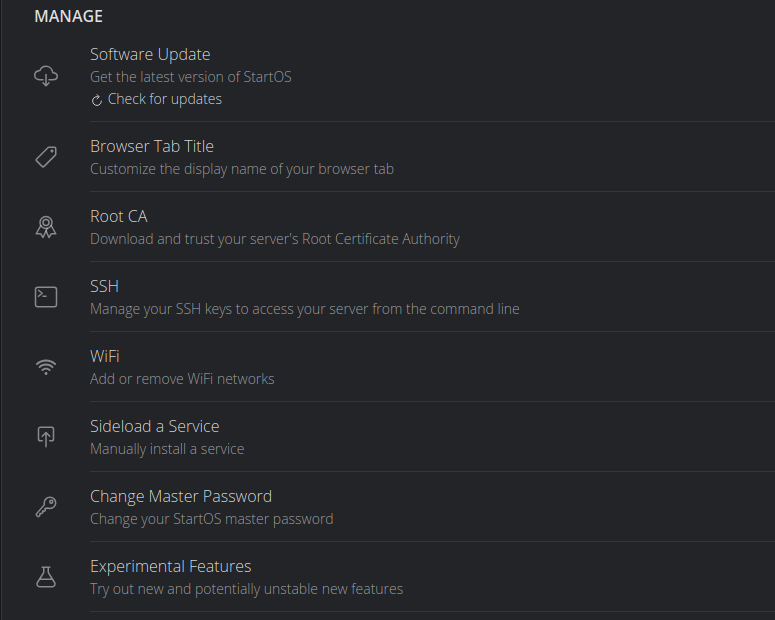

3. Upload the `.s9pk` file you downloaded

4. Wait for the installation to complete

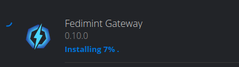

#### Initial Configuration

After installation, the gateway will show a "Needs Config" status. Click **Configure** to set up your gateway.

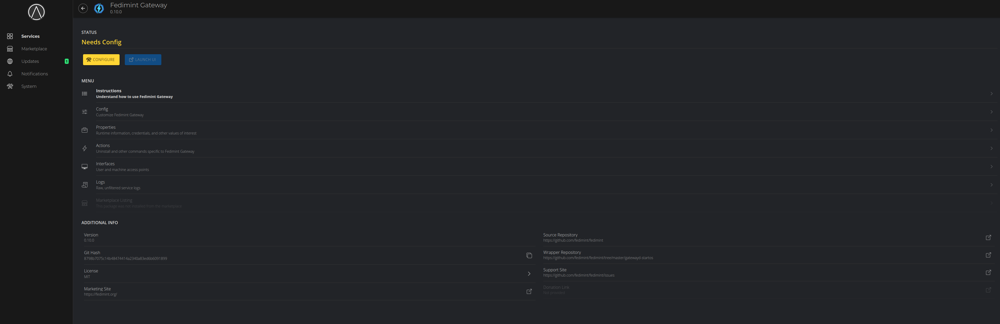

#### Configuring the LDK Backend

For the integrated Lightning node:

1. Set **Backend Type** to "LDK (Integrated)"
2. Enter a **Node Alias** for your Lightning node (e.g., "Fedimint LDK Gateway")
3. Select your **Bitcoin Backend** (Bitcoin Core is recommended if you have it installed on Start9)
4. Enter a strong **Gateway Password**
5. Click **Save**

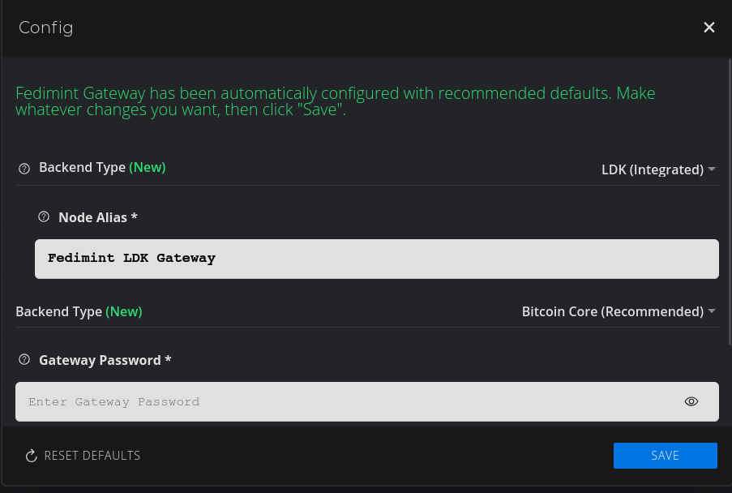

#### Configuring the LND Backend

To connect to an external LND node:

1. Set **Backend Type** to "LND (External)"
2. Select your **Bitcoin Backend** (Bitcoin Core is recommended if you have it installed on Start9)
3. Enter a strong **Gateway Password**
4. Click **Save**

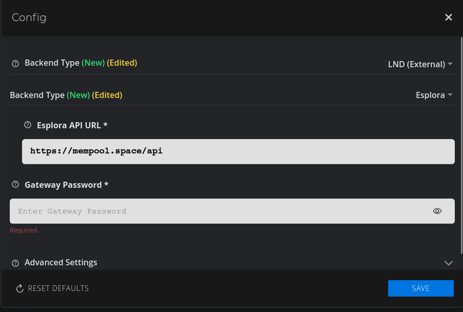

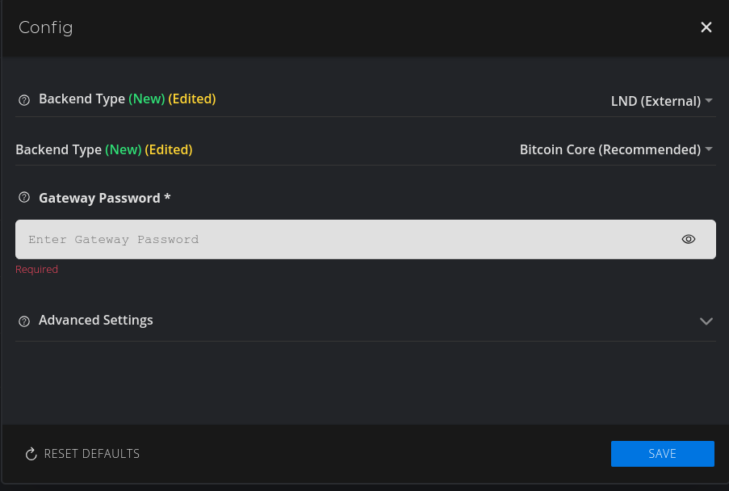

#### Accessing the Gateway

After configuration, click **Launch UI** from the gateway's service page to open the web interface. If you're using LDK, the gateway will need time to sync.

</details>

<details>
<summary><strong>Umbrel</strong></summary>

Umbrel support for the Fedimint Gateway is coming soon.

Follow the progress: [umbrel-apps PR #4554](https://github.com/getumbrel/umbrel-apps/pull/4554)

</details>

---

## Operating Your Gateway

Once your gateway is deployed, use the web UI to manage federations, monitor liquidity, and configure settings.

<details>
<summary><strong>Connecting a Federation</strong></summary>

To facilitate Lightning payments for a federation, your gateway must first connect to it.

#### How to Connect


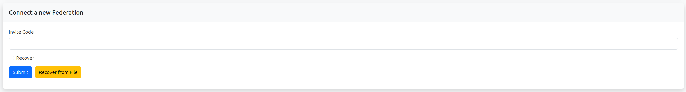

1. Obtain the **federation invite code** from a federation guardian
2. Navigate to the **Connect a new Federation** section in the gateway UI
3. Paste the invite code into the **Invite Code** field
4. Click **Submit**

After connecting, your gateway will have an ecash wallet for that federation. The federation will appear in your dashboard with a balance of zero.


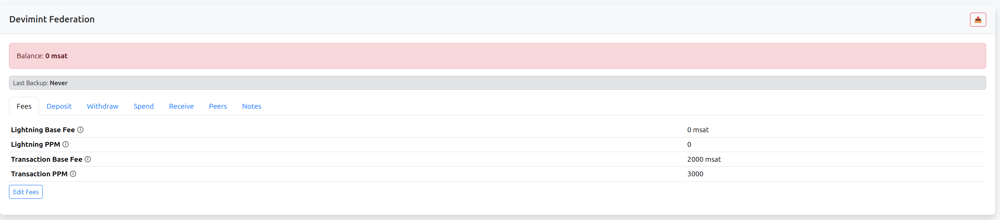

#### Recovering Federation Connections

If you're restoring a gateway from backup, you can recover your federation connections:

**Single Federation Recovery:**
1. Enter the federation invite code
2. Check the **Recover** checkbox
3. Click **Submit**

**Bulk Recovery from Backup File:**
It is recommended after joining a federation to backup the invites codes for all of your connected federations. You can do this by clicking **Export Invite Codes**

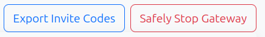

To recover from an exported invite code JSON file:

1. Click **Recover from File**
2. Upload your `gateway-invite-codes.json` backup file
3. The gateway will sequentially recover all federations from the backup
4. Review the recovery results showing which federations were recovered, skipped, or failed

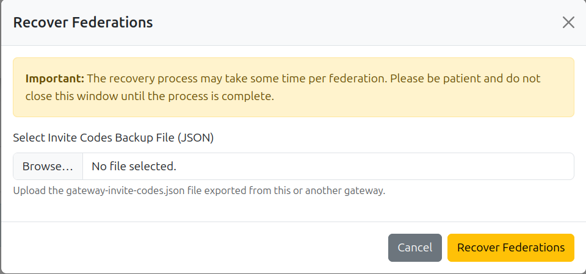

</details>

<details>
<summary><strong>Registering Your Gateway</strong></summary>

After connecting to a federation, your gateway has an ecash wallet but is not yet discoverable by federation users. Guardians must explicitly register your gateway to make it available.

#### Why Registration is Required

Guardians control which gateways can provide Lightning services to their federation. This ensures quality of service and protects users from unreliable gateways.

#### How to Register

1. Find your gateway's URL in the **Gateway Network Information** card on your dashboard
2. Copy either the **Iroh URL** or **HTTP URL**

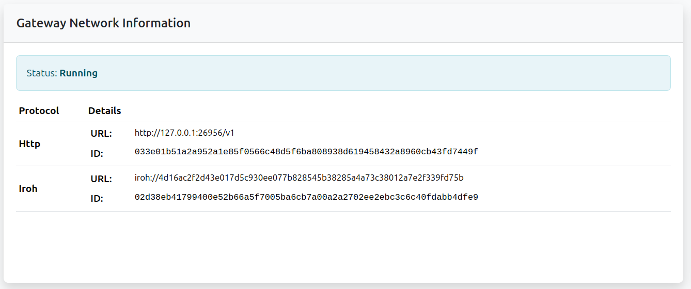

3. Contact a guardian of the federation you want to serve
4. Provide them with your gateway URL
5. The guardian will register your gateway through their guardian UI

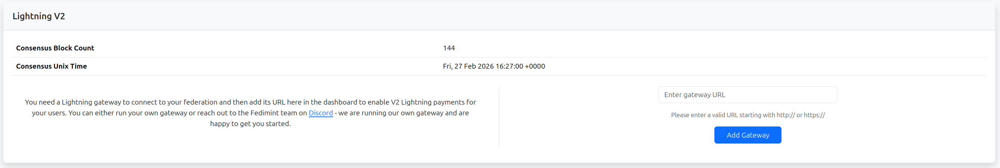

</details>

<details>
<summary><strong>Funding the Federation</strong></summary>

Your gateway needs ecash in each federation to process **incoming** Lightning payments. When a user receives a Lightning payment through your gateway, you give them ecash and keep the Lightning payment.

| Payment Direction | What Gateway Needs |
|-------------------|-------------------|
| **Incoming** (user receives Lightning) | Ecash to give the user + inbound Lightning liquidity |
| **Outgoing** (user sends Lightning) | Outbound Lightning liquidity to pay the invoice |

#### Depositing Bitcoin for Ecash

1. Navigate to the federation card you want to fund
2. Click the **Deposit** tab
3. Click **New Deposit Address** to generate a peg-in address

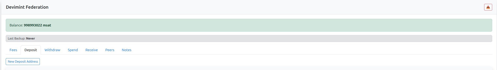

4. A QR code and copyable address will be displayed
5. Send Bitcoin to this address from any wallet
6. Wait for the required confirmations (typically 10 blocks, set by the federation's `finality_delay`)
7. Your ecash balance will update automatically

#### Withdrawing Ecash for Bitcoin

To withdraw funds from a federation back to on-chain Bitcoin:

1. Navigate to the federation card
2. Click the **Withdraw** tab
3. Enter the amount (in sats) or select "all"
4. Enter the destination Bitcoin address
5. Click **Preview** to see fees and transaction details
6. Review the breakdown: amount, fee rate, transaction size, peg-out fee, mint fee estimate
7. Click **Confirm Withdraw** to execute

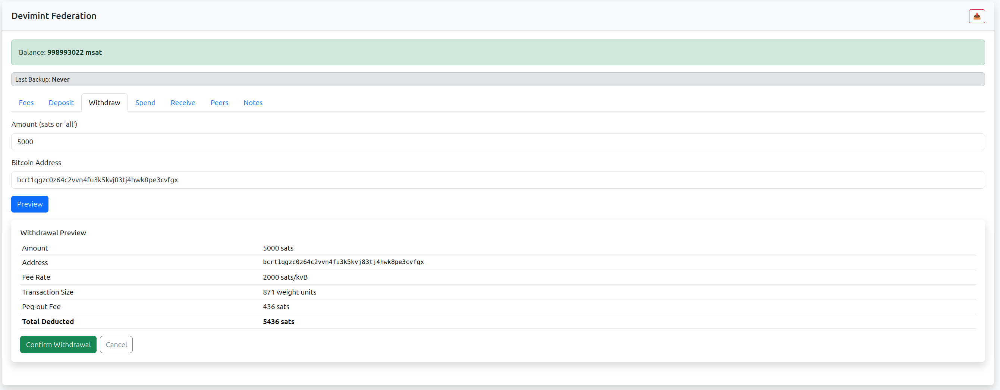

#### Receiving Ecash Directly

You can also receive ecash notes directly (out-of-band transfer):

1. Navigate to the federation card
2. Click the **Receive** tab

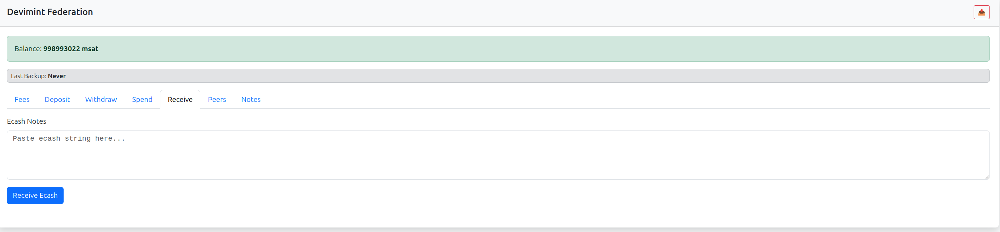

3. Paste the ecash notes into the text area
4. Click **Receive Ecash**
5. Your balance updates immediately upon successful redemption

#### Spending Ecash

To create ecash notes for out-of-band transfer:

1. Navigate to the federation card
2. Click the **Spend** tab
3. Enter the amount in millisatoshis
4. Click **Spend**
5. Copy the generated ecash notes string
6. Share with the recipient (they can redeem in any Fedimint wallet)

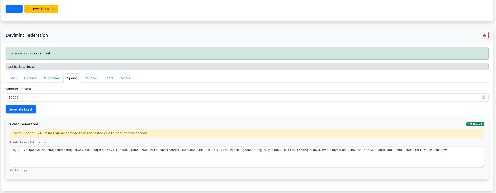

If there are mint fees enabled on the federation, spending ecash will sometimes over spend by ~512 msats due to the available note denominations.

</details>

<details>
<summary><strong>Manage Your Lightning Node</strong></summary>

The **Lightning Node** card provides full control over your gateway's Lightning operations.

#### Connection Info

View your Lightning node configuration:
- **Node Type** - External LND or Internal LDK
- **Network** - Bitcoin mainnet, signet, or regtest
- **Block Height** - The Bitcoin block height of the Lightning Node
- **Status** - `Synced`, `Syncing`, or `Not Connected`
- **Alias** - The alias of the Lightning Node
- **Public Key** - The Lightning Node's public key
- **LND or LDK Configuration** - Connection info and configuration options that are specific to LND or LDK

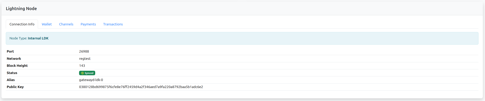

#### On-Chain Wallet

Manage the Lightning node's on-chain Bitcoin wallet:

**View Balance:** Displays your current on-chain balance in sats.

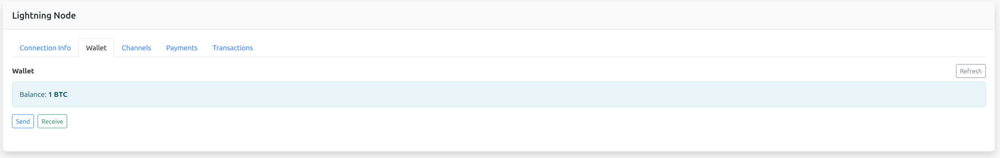

**Receive Bitcoin:**
1. Click the **Wallet** tab
2. Click **Receive** to generate a new address
3. A QR code and copyable address will be displayed

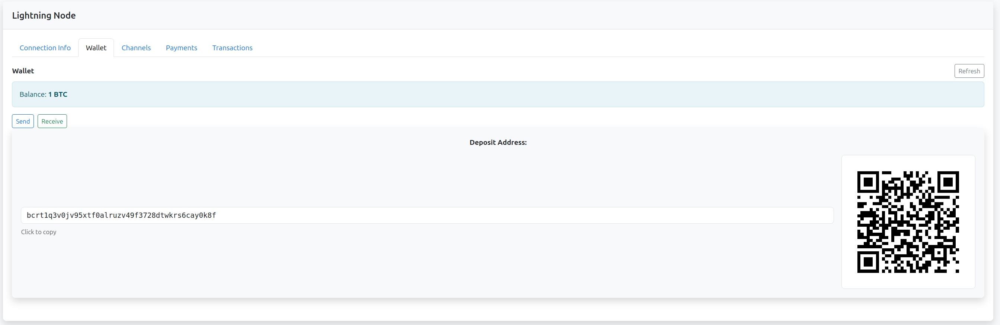

**Send Bitcoin:**
1. Click the **Wallet** tab
2. Enter the destination Bitcoin address
3. Enter the amount (in sats) or "all"
4. Enter the fee rate (sats per vbyte)
5. Click **Confirm Send**

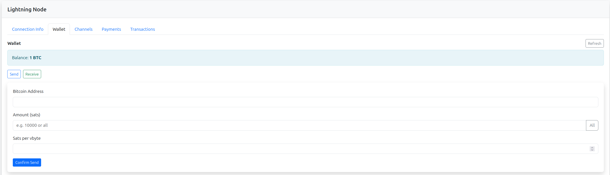

#### Channel Management

View and manage your Lightning channels:

**Channel List:**
- Remote peer's public key and alias
- Channel size and funding outpoint
- Active/Inactive status
- Visual liquidity bar showing outbound (green) and inbound (blue) capacity

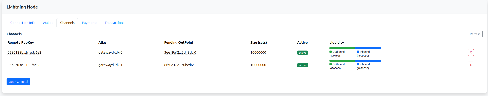

**Open a Channel:**
1. Click the **Channels** tab
2. Enter the remote node's public key
3. Enter the host address (e.g., `1.2.3.4:9735`)
4. Enter the channel size in sats
5. Click **Confirm Open**

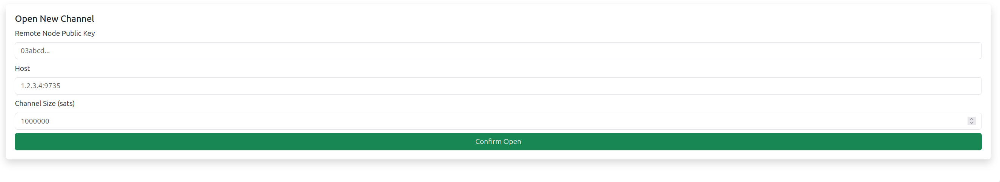

**Close a Channel:**
1. Find the channel in the list
2. Click the **X** button
3. Optionally check **Force Close** (use only if peer is unresponsive)
4. Enter fee rate (sats per vbyte)
5. Click **Confirm Close**

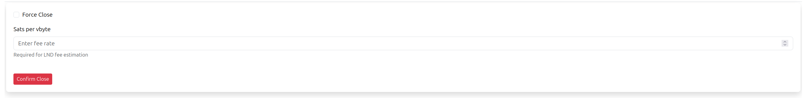

#### Lightning Payments

Send and receive Lightning payments directly from your gateway:

**Send a Payment:**
1. Click the **Payments** tab
2. Paste a BOLT11 invoice or BOLT12 offer. BOLT12 is only supported on LDK.
3. The UI auto-detects the payment type and shows details
4. For BOLT12, optionally enter amount and payer note
5. Click **Send**

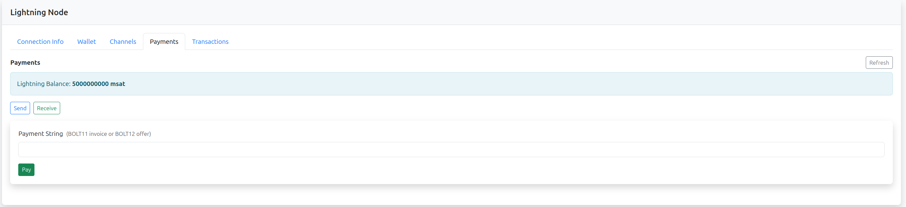

**Receive a Payment:**
1. Click the **Payments** tab
2. Enter the amount (optional for BOLT12). BOLT12 is only supported on LDK.
3. Enter an optional description
4. Click **Create**
5. Copy the BOLT11 invoice or BOLT12 offer (tabs available for each)
6. QR codes are provided for easy sharing

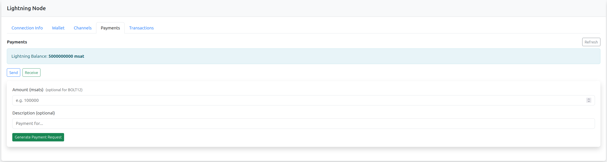

#### Transaction History

View past Lightning transactions:
1. Click the **Transactions** tab
2. Use the date filters or click **Last Day** to reset the filter to the last day.
3. View payment kind, direction, status, amount, and timestamp
4. Expand entries to see payment hash and preimage details

**Note** this list of transaction will include all Lightning transactions that this node sent/receive, not just the payments that it facilitated on behalf of Fedimint users.

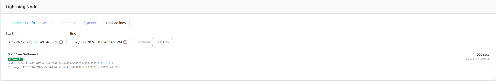

</details>

<details>
<summary><strong>Backup Your Gateway</strong></summary>

Regular backups protect your gateway's funds and configuration.

#### Backup Your Secret Phrase (Mnemonic)

Your gateway's 12-word recovery phrase can restore your Lightning wallet and gateway identity:

1. Navigate to the **Gateway Secret Phrase** card
2. Enter your gateway password
3. Click **Show** to reveal the mnemonic
4. Write down all 12 words in order and store them securely
5. Click **Hide** when done

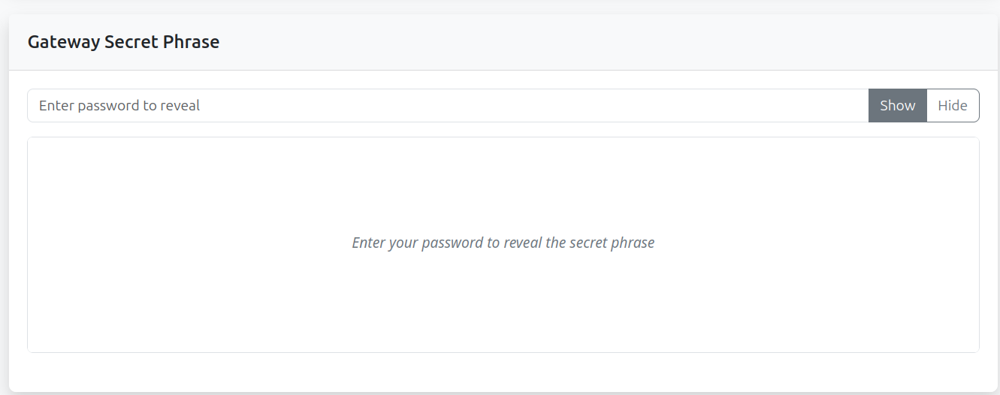

**Security Notes:**
- Never share your recovery phrase with anyone
- Store it offline in a secure location

#### Export Federation Invite Codes

As mentioned above, it is recommended after joining a federation to backup the invites codes for all of your connected federations. You can do this by clicking **Export Invite Codes**


1. Click **Export Invite Codes** in the dashboard header
2. A `gateway-invite-codes.json` file will download
3. Store this file. It only contains public data and can be backed up on a cloud storage account or on your own computer.

This backup allows you to recover all federation connections when restoring a gateway. You'll be reminded to export after joining or leaving federations.

#### Recovery Process

To restore a gateway from backup:

1. Deploy a new gateway instance
2. During setup, choose **Recover Wallet**
3. Enter your 12-word recovery phrase
4. After the gateway starts, use **Recover from File** to restore federation connections


5. Your balances and configuration will be restored

</details>

<details>
<summary><strong>Customize Routing Fees</strong></summary>

You can customize the fees the gateway charges per-federation for routing Lightning payments or doing swaps between federations.

#### Fee Types

| Fee | Description |
|-----|-------------|
| **Lightning Base Fee** | Fixed fee (in millisatoshis) charged for each outgoing Lightning payment |
| **Lightning PPM** | Variable fee as parts-per-million of the outgoing payment amount |
| **Transaction Base Fee** | Fixed fee (in millisatoshis) charged for swaps between federations |
| **Transaction PPM** | Variable fee to cover charged for swaps between federations |

#### How to Set Fees

Fees are configured per-federation:

1. Navigate to the federation card
2. Click the **Fees** tab (shown by default)
3. Click **Edit Fees**
4. Enter values for each fee type:
   - Lightning Base Fee (msats)
   - Lightning PPM
   - Transaction Base Fee (msats)
   - Transaction PPM
5. Click **Save Fees**

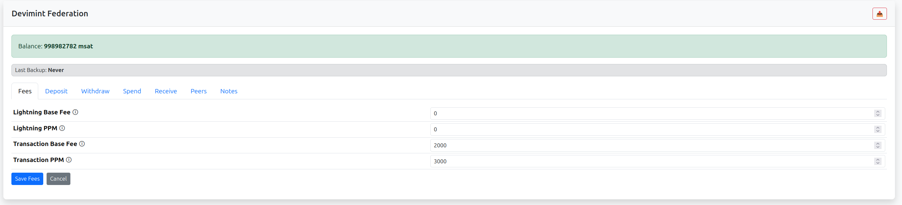

</details>

<details>
<summary><strong>Monitor Your Gateway</strong></summary>

Effective monitoring ensures your gateway operates smoothly and profitably.

#### Liquidity Overview

Monitor your liquidity across all three layers:

| Layer | What to Monitor | Why It Matters |
|-------|-----------------|----------------|
| **On-chain** | Lightning node wallet balance | Funds for opening channels |
| **Lightning** | Inbound/outbound capacity per channel | Determines Lightning payment routing capability |
| **Ecash** | Balance per federation | Limits incoming Lightning payments per federation |

**Key metrics to watch:**
- **Inbound liquidity** - How much others can send to you via Lightning (blue in channel bars)
- **Outbound liquidity** - How much you can send via Lightning (green in channel bars)
- **Ecash per federation** - Your capacity for incoming payments (shown in federation card headers)

#### Payment Summary

The **Payment Summary** card shows aggregate statistics for the last 24 hours:

**Outgoing Payments:**
- Total successful/failed payment counts
- Total fees collected
- Average and median latency

**Incoming Payments:**
- Same statistics as outgoing

Use this to understand your gateway's throughput and reliability.

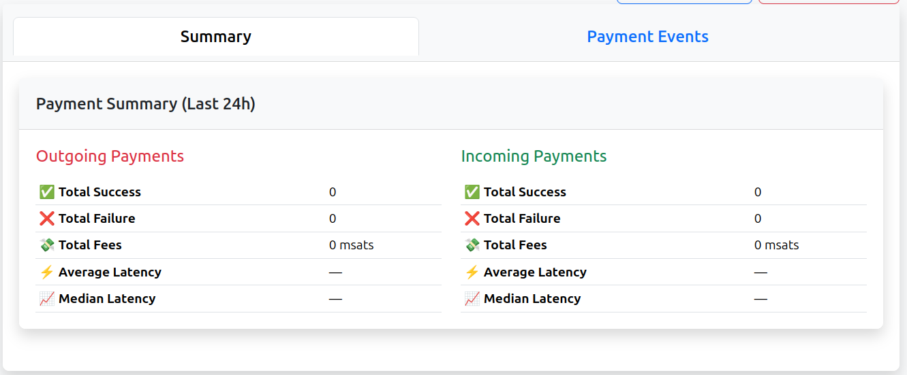

#### Payment Events Log

If you're interested in learning details about a specific payment, the **Payment Events** tab provides detailed transaction history. These events will only include payments that the gateway facilitated on behalf of Fedimint users. It will not include transactions initiated by the Lightning Node.

**Filter Options:**
- Filter by federation
- Filter by event type (Lightning, Wallet, Ecash events)

**Event Types:**
- **Lightning:** Outgoing/Incoming Started, Succeeded, Failed
- **Wallet:** Onchain withdraws and deposits
- **Ecash:** Notes spent, Notes reissued

Each event shows:
- Event kind and timestamp
- Expandable JSON details for debugging

Use the payment log to:
- Debug failed payments
- Track specific transactions
- Audit gateway activity
- Analyze payment patterns

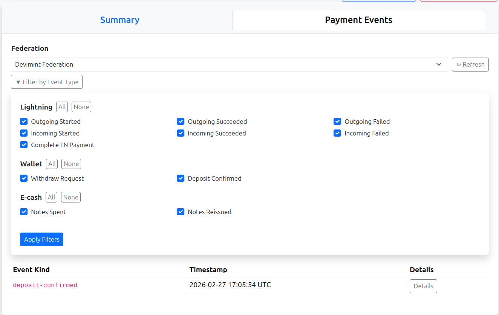

</details>

---

## FAQ

<details>
<summary><strong>What's the difference between HTTP and Iroh endpoints?</strong></summary>

They provide the same functionality to Fedimint clients, the only difference is how the clients connect to the gateway. The **HTTP endpoint** requires a valid domain name, TLS certificate, and the gateway must be running on a publicly accessible server. In the default docker, Start9, and Umbrel deployments described above, only the Iroh endpoint is enabled by default. The **Iroh endpoint** does not require a valid domain name, TLS certificate, and can be run on self-hosted infrastructure behind a NAT.

- **HTTP endpoint:** Clients connect to your gateway's URL via HTTP. Requires your gateway to be publicly accessible or port-forwarded.
- **Iroh endpoint:** Clients connect using the [Iroh](https://iroh.computer/) protocol. Enables direct connections without requiring a publicly accessible server. Better for gateways behind NAT or firewalls.

</details>

<details>
<summary><strong>I never registered my gateway with a federation I connected to, but I am still able to route Lightning payments</strong></summary>

This is expected behavior if you're running an **LND gateway** and the federation supports **LNv1**.

The older Lightning protocol (LNv1) does not require explicit permission from guardians to register your gateway. LND gateways automatically register with federations that support LNV1. The gateway has been designed to be transparent to the Lightning protocol, both LNv1 and LNv2 protocols are supported by LND gateways.

**Key points:**
- Only **LND gateways** support LNv1 (LDK gateways do not)
- All new federations support both LNv1 and LNv2
- LND gateways can route payments via LNv1 without explicit guardian registration
- To use LNv2 (which offers some improvements), you will need to register with guardians

If you want to ensure you're using the newer LNv2 protocol, you'll need to complete the [registration process](#registering-your-gateway) with the federation's guardians.

</details>

<details>
<summary><strong>What is the difference between LNv1 and LNv2?</strong></summary>

Fedimint has two Lightning protocols: LNv2 and LNv1. We will be moving to deprecate LNv1. The main differences are:

| Aspect | LNv1 | LNv2 |
|--------|------|------|
| **Gateway Registration** | Gateways automatically register with the federation | Requires explicit guardian approval |
| **Invoice Creation** | Created by the Fedimint client | Created by the gateway |
| **Backend Support** | LND only | LND and LDK |
| **Incoming Payment Detection** | HTLC interception | HOLD invoices |

**LNv1** uses HTLC interception, where the gateway monitors all incoming HTLCs and intercepts those destined for Fedimint users. This allows permissionless gateway operation but only works with LND.

**LNv2** uses HOLD invoices created directly by the gateway. Users send their payment request to a specific gateway, which creates the Lightning invoice.

For detailed protocol diagrams, see:
- [Lightning Module V1 Protocol](./lightning_module_v1.md)
- [Lightning Module V2 Protocol](./lightning_module_v2.md)

</details>

<details>
<summary><strong>My gateway won't start. What should I check?</strong></summary>

- **Check logs:** Run `docker compose logs gatewayd` to see error messages
- **Verify password hash:** Ensure `FM_GATEWAY_BCRYPT_PASSWORD_HASH` is set correctly. Remember to escape `$` as `$$` in docker-compose.yaml
- **Port conflicts:** Ensure ports 8176, 8177, and 10010 aren't already in use by another service

</details>

<details>
<summary><strong>Why are my payments failing?</strong></summary>

- **Check liquidity:** Ensure you have sufficient Lightning channel capacity (outbound for sending, inbound for receiving) and ecash balance (for incoming payments to federations)
- **Verify channels:** Confirm your Lightning channels are active and the peer nodes are online
- **Review payment log:** Check the Payment Events tab in the gateway UI for specific error messages on failed payments

</details>

<details>
<summary><strong>I can't connect to a federation. How do I fix this?</strong></summary>

- **Guardian unavailable:** The guardian you are connecting to might be down. Try an invite code from a different guardian or try again later
- **Verify invite code:** Ensure the invite code is complete and valid. It should be a long string - make sure you copied it entirely
- **Review gateway logs:** Run `docker compose logs gatewayd` and look for specific connection error messages

</details>

<details>
<summary><strong>How do I recover my gateway after losing my server?</strong></summary>

1. Deploy a fresh gateway instance using the same deployment method (Docker, Start9, etc.)
2. During initial setup, choose **Recover Wallet** instead of creating a new one
3. Enter your 12-word recovery phrase
4. After the gateway starts, click **Recover from File** and upload your `gateway-invite-codes.json` backup
5. Your federation connections and balances will be restored

See [Backup Your Gateway](#backup-your-gateway) for details on creating backups before you need them.

</details>

<details>
<summary><strong>Why do I need ecash to process incoming Lightning payments?</strong></summary>

When a federation user receives a Lightning payment through your gateway:
1. The sender pays Lightning to your gateway's node
2. Your gateway gives ecash to the recipient in the federation
3. You keep the Lightning payment (minus any fees you owe)

Without ecash in that federation, you have nothing to give the recipient, so you cannot complete the incoming payment.

</details>

---

## Additional Resources

- [Fedimint Documentation](https://fedimint.org)
- [GitHub Discussions](https://github.com/fedimint/fedimint/discussions) - Community support
- [Discord Server](https://chat.fedimint.org/) - `#mint-ops` channel for operators
- [Lightning Module Documentation](./lightning_module_v2.md) - Technical details on Lightning integration
