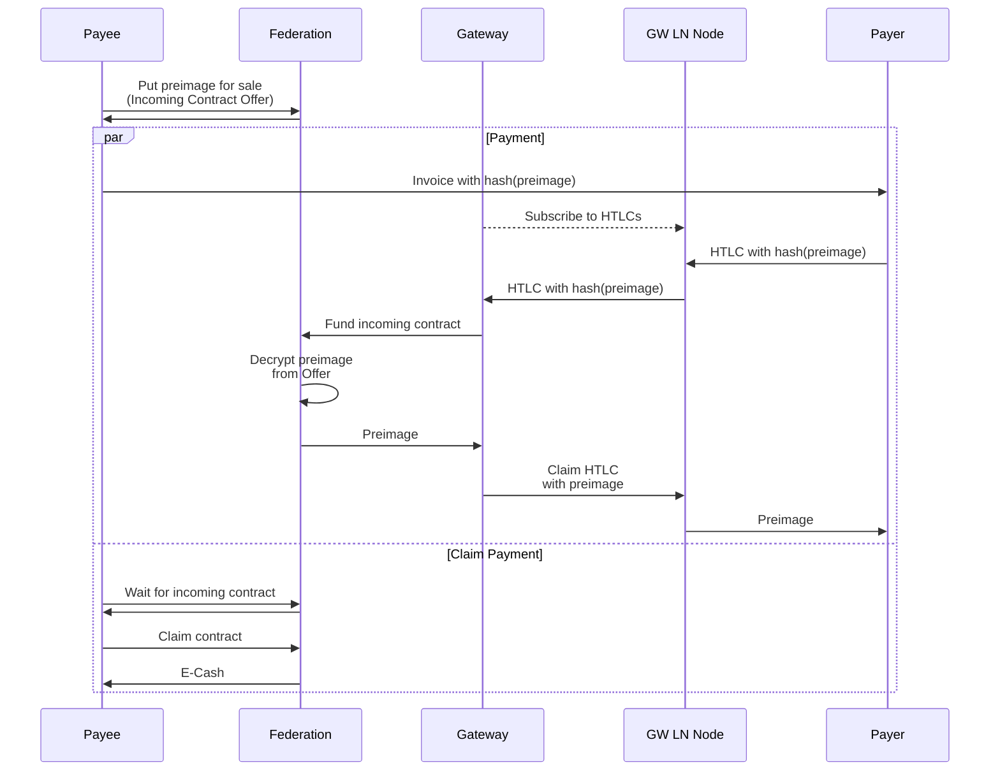
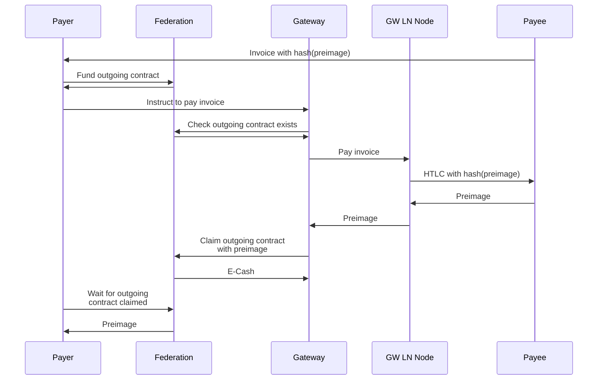

# Lightning Module V1 Protocol
On a high-level, we simply extend the LN network into the federation. The LN
Gateway acts as a translation layer between the trustless LN network and the
trusted federation. To do so, the LN gateway holds both e-cash (federation
IOUs) and balance in LN channels in its associated LN node. When sending
or receiving payments on behalf of users it exchanges one for the other.

See the diagrams below for details on incoming and outgoing flows.

## Receive

In the V1 Lightning protocol, the gateway uses HTLC interception to determine if an incoming payment is destined for a Fedimint.

## Send

