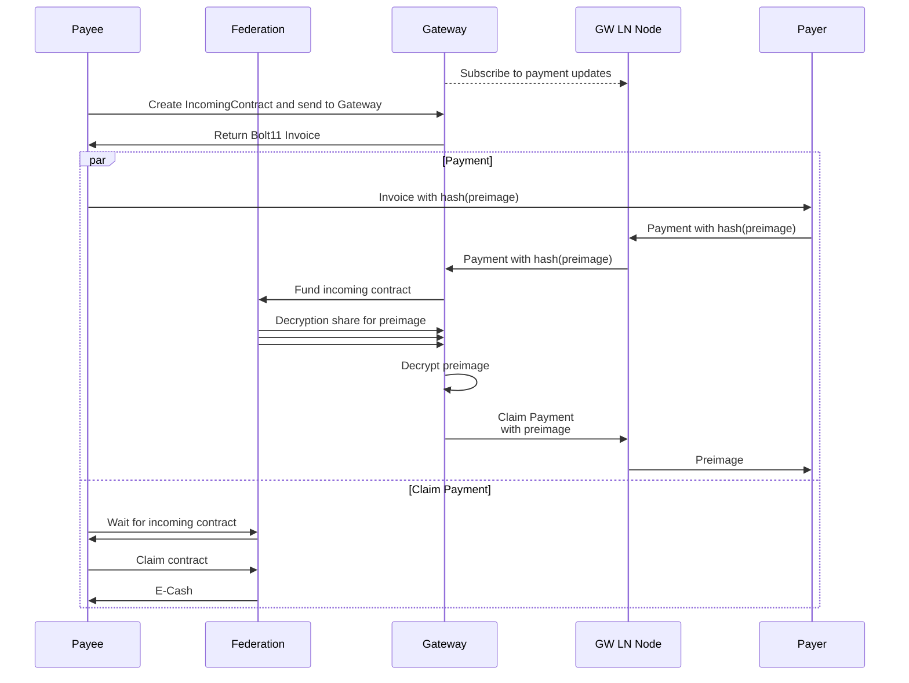
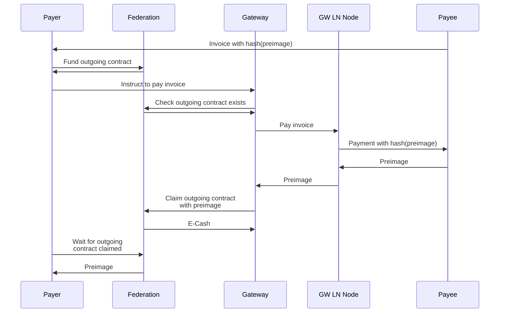

# Lightning Module V2 Protocol
The Lightning Module V2 protocol also extends the Lightning network into the federation, but makes some distinct changes from the V1 protocol. The gateway still holds e-cash (federation IOUs) and a balance in LN channels in the associated Lightning node. Below is a description of the changes from the V1 protocol and the associated diagrams.

## Receive
1) When receiving, the gateway uses HOLD invoices instead of HTLC interception to determine if a payment is destined for a Fedimint.
2) Users no longer put up a preimage for "sale" in an offer and instead directly create the `IncomingContract` and send it to a specific gateway.
3) The gateway is responsible for creating the Bolt11 invoice instead of the Fedimint client.
4) The gateway decrypts the preimage from the federation using the received decryption shares.

## Send
The V2 send protocol is very similar to the V1 send protocol. The main difference from V1 is that if the gateway fails to pay an invoice, in V2 it will return a `forfeit signature` to the client, which the client can use to claim the e-cash locked in the `OutgoingContract` before the specified timeout. Previously in V1, the gateway would need to submit a Fedimint transaction to modify the `OutgoingContract` to make it "cancellable".

The happy path for paying a Bolt 11 invoice in V1 and V2 remain the same:

