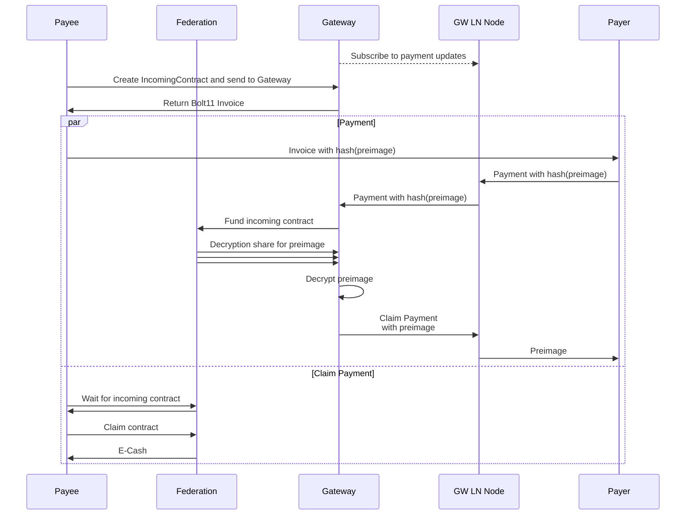
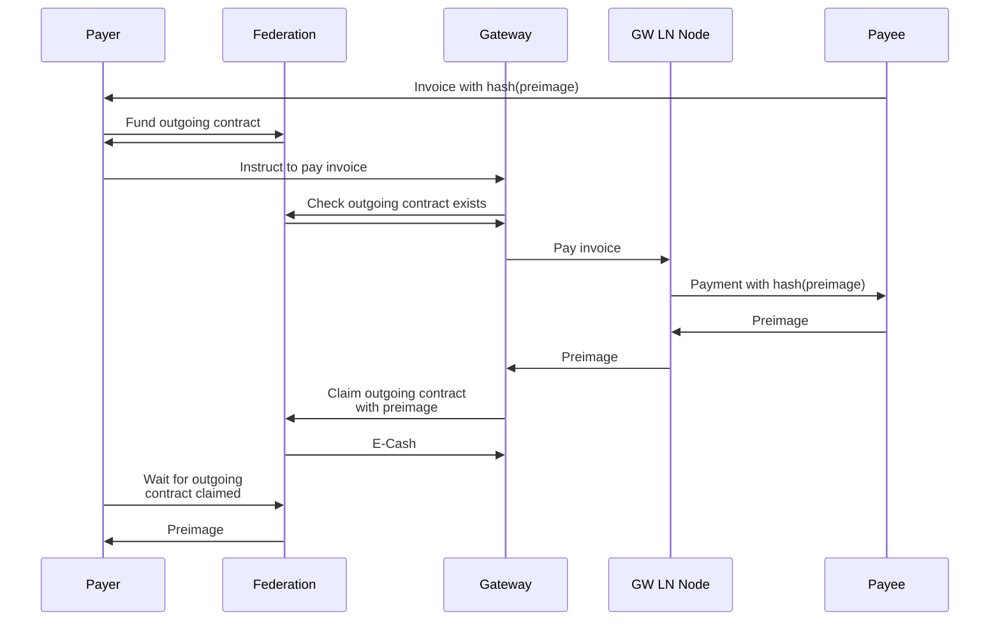
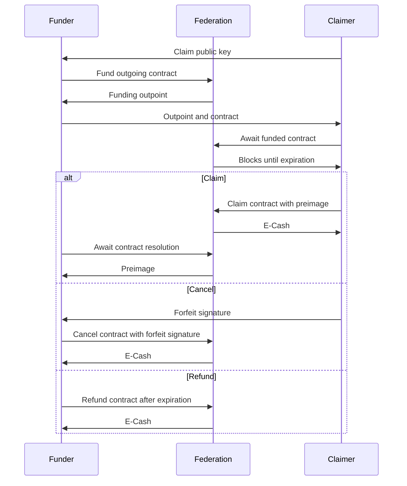

# Lightning Module V2 Protocol
The Lightning Module V2 protocol also extends the Lightning network into the federation, but makes some distinct changes from the V1 protocol. The gateway still holds e-cash (federation IOUs) and a balance in LN channels in the associated Lightning node. Below is a description of the changes from the V1 protocol and the associated diagrams.

## Receive
1) When receiving, the gateway uses HOLD invoices instead of HTLC interception to determine if a payment is destined for a Fedimint.
2) Users no longer put up a preimage for "sale" in an offer and instead directly create the `IncomingContract` and send it to a specific gateway.
3) The gateway is responsible for creating the Bolt11 invoice instead of the Fedimint client.
4) The gateway decrypts the preimage from the federation using the received decryption shares.


```mermaid
sequenceDiagram;
    participant r as Payee
    participant f as Federation
    participant g as Gateway
    participant gl as GW LN Node
    participant s as Payer
    g-->>gl: Subscribe to payment updates
    r->>g: Create IncomingContract and send to Gateway
    g->>r: Return Bolt11 Invoice
    par Payment
        r->>s: Invoice with hash(preimage)
        s->>gl: Payment with hash(preimage)
        gl->>g: Payment with hash(preimage)
        g->>f: Fund incoming contract
        f->>g: Decryption share for preimage
        f->>g: 
        f->>g: 
        g->>g: Decrypt preimage
        g->>gl: Claim Payment<br>with preimage
        gl->>s: Preimage
    and Claim Payment
        r->>f: Wait for incoming contract
        f->>r: 
        r->>f: Claim contract
        f->>r: E-Cash
    end
```

## Send
The V2 send protocol is very similar to the V1 send protocol. The main difference from V1 is that if the gateway fails to pay an invoice, in V2 it will return a `forfeit signature` to the client, which the client can use to claim the e-cash locked in the `OutgoingContract` before the specified timeout. Previously in V1, the gateway would need to submit a Fedimint transaction to modify the `OutgoingContract` to make it "cancellable".

The happy path for paying a Bolt 11 invoice in V1 and V2 remain the same:


```mermaid
sequenceDiagram;
    participant s as Payer
    participant f as Federation
    participant g as Gateway
    participant gl as GW LN Node
    participant r as Payee

    r->>s: Invoice with hash(preimage)
    s->>f: Fund outgoing contract
    f->>s: 
    s->>g: Instruct to pay invoice
    g->>f: Check outgoing contract exists
    f->>g: 
    g->>gl: Pay invoice
    gl->>r: Payment with hash(preimage)
    r->>gl: Preimage
    gl->>g: Preimage
    g->>f: Claim outgoing contract<br>with preimage
    f->>g: E-Cash
    s->>f: Wait for outgoing<br>contract claimed
    f->>s: Preimage
```
## Direct HTLC
The `OutgoingContract` can also be used as a plain HTLC between two clients of the same federation, without any gateway involvement, e.g. to swap e-cash atomically against funds on another chain or in another system. The client exposes this via the `lnv2 htlc` CLI subcommands, backed by the `htlc` module of `fedimint-lnv2-client`. No server-side code is involved beyond the existing `OutgoingContract` rules, so every federation running the V2 module supports it.

The funder locks e-cash to the counterparty's claim key. The claimer claims it with the preimage before the contract expires, which reveals the preimage to the funder. A failed swap is either cancelled cooperatively before the expiration with the claimer's forfeit signature, or refunded unilaterally by the funder after the expiration.


```mermaid
sequenceDiagram;
    participant a as Funder
    participant f as Federation
    participant b as Claimer

    b->>a: Claim public key
    a->>f: Fund outgoing contract
    f->>a: Funding outpoint
    a->>b: Outpoint and contract
    b->>f: Await funded contract
    f->>b: Blocks until expiration
    alt Claim
        b->>f: Claim contract with preimage
        f->>b: E-Cash
        a->>f: Await contract resolution
        f->>a: Preimage
    else Cancel
        b->>a: Forfeit signature
        a->>f: Cancel contract with forfeit signature
        f->>a: E-Cash
    else Refund
        a->>f: Refund contract after expiration
        f->>a: E-Cash
    end
```

### Out-of-band handoff
All coordination data is exchanged out of band: the claim public key from the claimer to the funder before funding, the funding outpoint and the contract from the funder to the claimer after funding, and the forfeit signature from the claimer to the funder to cancel. `lnv2 htlc create` prints the operation id, the outpoint and the contract as JSON, and the follow-up commands take the contract in the same JSON representation as an argument:

```json
{
  "operation_id": "<hex>",
  "outpoint": { "txid": "<hex>", "out_idx": 0 },
  "contract": {
    "payment_image": { "Hash": "<sha256 hex>" },
    "amount": 1000000,
    "expiration": 12345,
    "claim_pk": "<compressed pubkey hex>",
    "refund_pk": "<compressed pubkey hex>",
    "ephemeral_pk": "<compressed pubkey hex>"
  }
}
```

- The contract is always output zero of its funding transaction. The follow-up commands take the txid as a positional argument and the output index via `--out-idx`, which defaults to zero.
- A point-locked contract has `"payment_image": { "Point": "<compressed pubkey hex>" }` instead.
- The `amount` is in millisatoshis. Preimages are 32 bytes in hex; secret keys, public keys and forfeit signatures use the usual secp256k1 hex encodings.
- The claimer's `await-funded` verifies that exactly this contract is funded at the outpoint and returns the number of blocks remaining until its expiration, and should be run before taking any action of its own, e.g. sending funds on another chain.

### Payment images
A hash lock (`--payment-hash`) locks the contract to the SHA-256 hash of a 32-byte preimage and is interoperable with any system using the same construction, such as Lightning HTLCs or Cashu NUT-14. A point lock (`--payment-point`) locks the contract to a secp256k1 public key whose secret key is the preimage.

### Expiration
Contract expirations are absolute block counts as tracked by the federation's consensus, not unix timestamps. `lnv2 htlc create` takes the number of blocks until the expiration and adds it to the federation's current consensus block count. Since the preimage becomes public with the claim transaction, the claimer has to leave enough margin before the expiration. Refunds are only accepted once the consensus block count has reached the expiration, which lags the chain tip by the federation's block count consensus.
