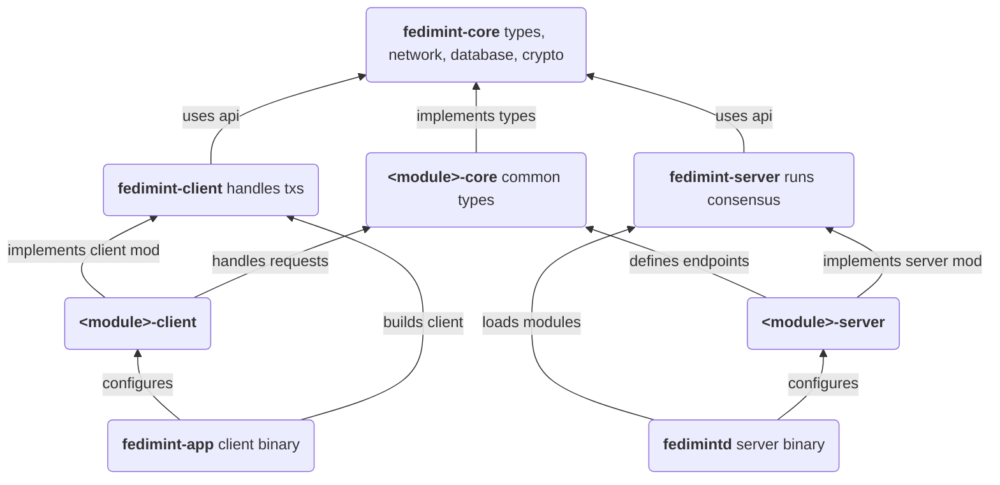

# Modular Architecture
Below is a high-level diagram of the modular architecture of Fedimint.

```mermaid
flowchart BT;
    d(<b>fedimintd</b> server binary)
    server(<b>fedimint-server</b> runs consensus)
    app(<b>fedimint-app</b> client binary)
    core(<b>fedimint-core</b> types, network, database, crypto)
    client(<b>fedimint-client</b> handles txs)

    mcore("<b>&lt;module>-core</b>" common types)
    mclient("<b>&lt;module>-client</b>")
    mserver("<b>&lt;module>-server</b>")

    d-->|loads modules|server
    d-->|configures|mserver
    mserver-->|defines endpoints|mcore
    mserver-->|implements server mod|server
    mcore-->|implements types|core
    mclient-->|implements client mod|client
    mclient-->|handles requests|mcore
    client-->|uses api|core
    server-->|uses api|core
    app-->|configures|mclient
    app-->|builds client|client
```

