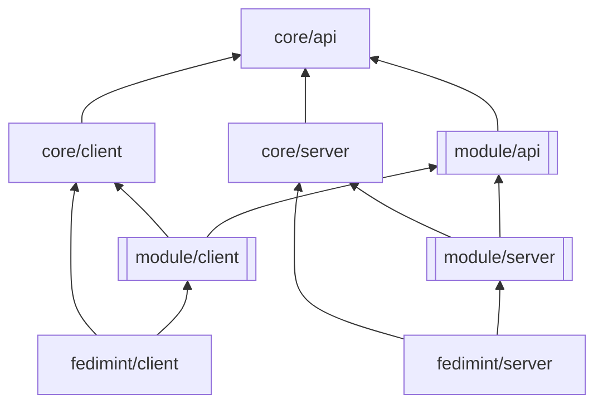

# Modular Architecture
Below is a high-level description of the modular architecture of Fedimint.

## Dependency Tree

## Crate Descriptions
`core` are the libraries that we make available to module developers
- `core/api` - module type interfaces (txs, inputs, output, etc.), database, and API encoding/decoding
- `core/client` - client interfaces, types, and logic (tx builder, query strategies)
- `core/server` - server interfaces, types, and logic (federation module, outcomes, consensus items, consensus/hbbft code)

`module` can be any module (e.g. ln/mint/wallet)
- `<module>/api` - api implementation (defines endpoints, implements types, module ids, custom serde logic)
- `<module>/client` - client implementation (creating txs, resolving outcomes, calls api)
- `<module>/server` - server implementation (tx validation, epoch handling, api impl)

`fedimint` builds the actual client and server binaries by wiring the modules together
- `fedimint/server` - registers the modules
- `fedimint/client` - constructs a specific client api, e.g. wallet/ln txs give mint change

other misc crates
- `crypto/tbs` - custom threshold cryptography
- `integrationtests` - tests

We separate the `client`, `server`, and `api` crates because:
- Clients need to compile to WASM and cannot use libraries such as `tokio`
- Servers need to minimize dependencies for security
- Clients and servers communicate via the API and share common types

## Refactoring Plan
We can probably do the migration in 3 big steps:
1. Define the interfaces in `core/*` with temporary adapter functions between the old and new types
  - `fedimint-api` becomes `core/api` without too many changes
  - `fedimint-core` will be eventually eliminated by the types in `core/api` but can temporarily hold the old types and adapter functions
2. Migrate server-side and all modules
  - `fedimint` splits into `core/server` and `fedimint/server`
  - `modules/*` splits into `<module>/server` and `<module>/api`
3. Migrate client-side and all modules
  - `client-lib` splits into `<module>/client`, `core/client`, and `fedimint/client`

If necessary we can cheat by putting more things into `fedimint/client` and `fedimint/server` that will later be refactored into the `modules` and `core`.
