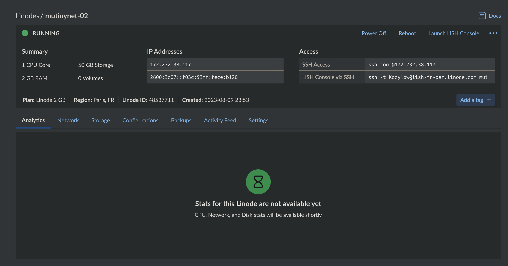
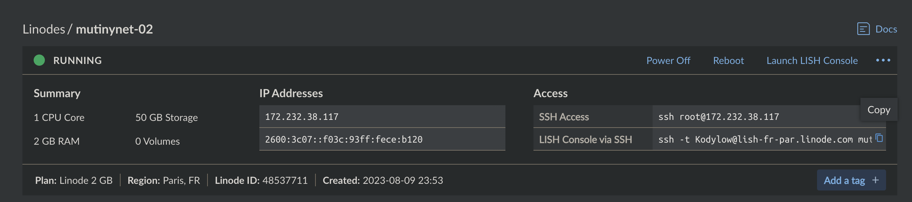
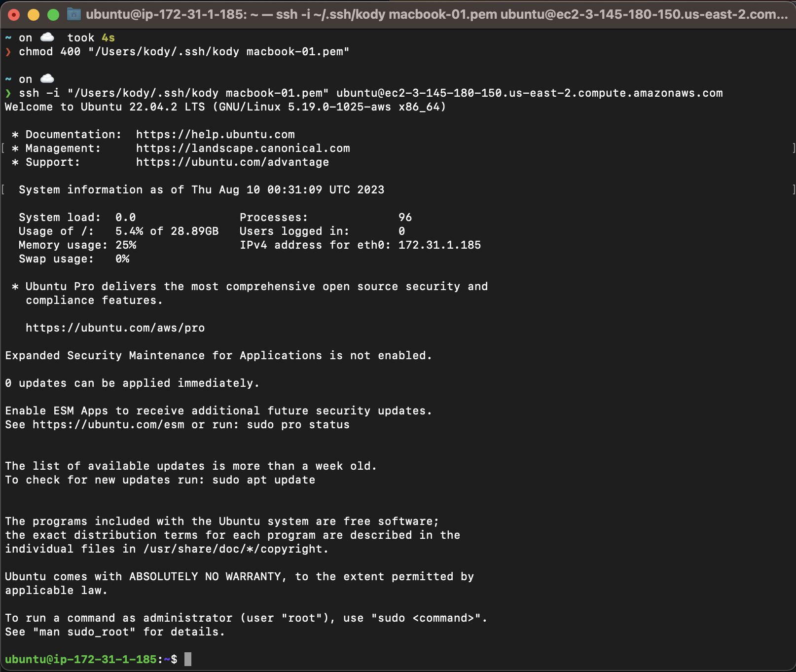
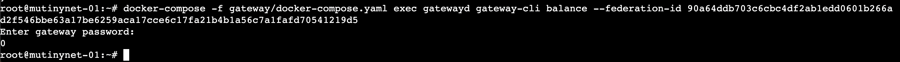

# Setting up a 3/4 Federation + Lightning Gateway on Mutinynet

## Step 1. Provisioning VPS's
For this setup we'll be setting up a 3/4 Federation, then a Lightning Gateway to service the federation. The default docker install scripts install both the fedimint daemon and gateway on each machine.

Fedimint can run with any t/n configuration including 1/1, so feel free to use any number of machines you want or just run it locally. However the power of fedimint is in the redundancy of the federation, and at the end of this guide we'll see how we can kill a machine and the federation will continue to function.

I'll be using Digital Ocean, Linode, and Amazon EC2 for this guide, but any VPS provider or your own hardware will work if it can run Linux and Docker. Feel free to use 

### 1.1. Digital Ocean Setup

- Default Ubuntu image


- `fedimintd` can reliably run on the $12 2GB RAM/1 CPU machine, but for the machine that'll also be running the lightning gateway you might want to use the 2CPU machine (not required, but it'll make the gateway run a bit smoother)


- Auth with SSH keys (recommended) or password. Digital Ocean has an excellent guide on how to set up SSH keys if you click "New SSH Key" in the "Authentication" section.


- Finalize and create the droplet. You can create multiple droplets with the same configuration, so if you want just create your 4 droplets now for the 3/4 federation + lightning gateway and skip to section 2 to install the software. Otherwise continue to the next step to create the other machines.

- 

- You can SSH into the machine from your terminal by copying the ssh command for key or root user/password. Or just use the droplet terminal from the digital oceanconsole.


### 1.2. Linode Setup

For the Linode Setup we'll use the same $12 2GB/1CPU machine as Digital Ocean, if you're also running the lightning gateway off of this machine you'll want to use the 4GB/2CPU machine. We'll use the same ubuntu 22 image, set it up in par


- Set up the root password and SSH keys (recommended)


- Then create the machine.



- You can SSH into the machine from your terminal by copying the ssh command for key or root user/password:




### 1.3. Amazon EC2 Setup

For the AWS EC2 Setup we'll use the free tier t2.micro machine, which is 1GB RAM/1CPU. This is below the recommended specs but for a 3/4 federation it's redundant to this machine occasionally being slow or glitching out, and at the end of this tutorial we'll kill the machine entirely and demonstrate the federation continuing to operate. 

- Use your ssh keys (you'll have to import them for EC2 in the console beforehand), set a security group, and free tier EC2 lets you have up to 30GB of storage.


- Then in your EC2 management console select "Connect your instance", adjust the key visibility, and you'll be able to ssh into the machine


- Then you're good to connect to the machine from a terminal:



### 1.4. Google Cloud Setup

For the google cloud machine we'll use something a little bigger because we'll also run the lightning gateway on it. Google VMs generate new ssh keys for you so make sure you copy those down into your local to ssh into the machine.


- Then google VMs have a nice SSH button in the console that pops open a bash terminal connect to the machine.


## Step 2. Installing Fedimint w/ Docker

You should now have your machines running and be able to ssh into them. We'll install fedimint on each machine using the docker install script.

Notes for specific machines:
- If you're running on linode or aws you'll need to install and start docker and docker compose first. You can do this by running the following commands:
```bash
# update packages
sudo apt-get update
# add docker's gpg key
curl -fsSL https://download.docker.com/linux/ubuntu/gpg | sudo gpg --dearmor -o /usr/share/keyrings/docker-archive-keyring.gpg
# set up the stable repo for docker
echo "deb [arch=$(dpkg --print-architecture) signed-by=/usr/share/keyrings/docker-archive-keyring.gpg] https://download.docker.com/linux/ubuntu $(lsb_release -cs) stable" | sudo tee /etc/apt/sources.list.d/docker.list > /dev/null
# update packages again
sudo apt-get update
# install docker engine
sudo apt-get install docker-ce docker-ce-cli containerd.io
# start docker
sudo systemctl start docker
# enable docker startup on boot
sudo systemctl enable docker
# make a new docker group
newgrp docker
# add current user to docker group
sudo usermod -aG docker $USER
# make sure you set docker socket permissions for your user
sudo chown root:docker /var/run/docker.sock
sudo chmod 660 /var/run/docker.sock
# verify docker is working
sudo systemctl status docker
# restart docker to make sure the permissions are set
sudo systemctl restart docker
```

and if you get a "platform error" when trying to install with docker compose, you can run the following commands to install the most recent version of docker compose:
```bash
sudo curl -L "https://github.com/docker/compose/releases/latest/download/docker-compose-$(uname -s)-$(uname -m)" -o /usr/local/bin/docker-compose
```

Run the command below on each machine and it'll install:

1. Fedimintd: The fedimint daemon
2. LND + Gateway: A lightning node with fedimint gateway for intercepting HTLCs to provide lightning services for the federation
3. RTL: Ride the Lightning web interface for the the lightning node

and it'll start the services on the following ports:

- Fedimintd Guardian Dashboard: http://your.ip.add.ress:3000
- Lightning Gateway Dashboard: http://your.ip.add.ress:3001
- RTL Lightning Node Management: http://your.ip.add.ress.198:3003

### Fedimint Setup Script:
```bash 
curl -sSL https://gist.githubusercontent.com/otech47/ca281c9729495728b3232993121ec011/raw/07c0bae9f876082e88f548a8941fd188059e7665/setup.sh | bash
```


You've now got the fedimint processes running on each machine. Congratulations! However, they're not federated yet. We'll do that in the next step.

## Step 3. Forming the Federation

Now that we have the fedimint processes running on each machine, we'll form the federation by connecting them together. We'll use the fedimint guardian dashboard to do this. Go to the dashboard url for each machine, it's running on port :3000 .

> Note: If you're running on AWS EC2 you'll need to open port 3000 in your security group to access the dashboard, and if you're running on google cloud you'll need to open ports 3000 and 8174 in your firewall.


#### Leader


#### Follower


### DKG


### Guardian Verificaion


### Guardian Dashboard


- these are all hardcoded for now

The invite code doesn't populate yet so you'll have to get it from the command line with:

```bash
docker-compose -f fedimintd/docker-compose.yaml exec fedimintd fedimint-cli dev invite-code
```


Then connect with Fedi:

TODO: copy screenshots over from phone

### Setting up the Lightning Gateway

Now that we have the federation running, we'll set up the lightning gateway. This is a lightning node that will intercept HTLCs from the lightning network and forward them to the federation. This will allow us to provide lightning services to the federation.

First we have to connect to the federation. We'll use the same federation invite code as we do with the clients.

```bash
root@mutinynet-01:~# docker-compose -f fedimintd/docker-compose.yaml exec fedimintd fedimint-cli dev invite-code
{
  "invite_code": "fed11jznymkms83ktcn0j4v0d6pspkfn26t65dwlx8gtmucje4jshennvzlazrd9354k858a06uz5zgva2qqcwaen5te0xcuzuvfcxvhr2wpwxyunsw3cxymngta0klu5kt7vcla79lqnjvzwvmz0"
}
root@mutinynet-01:~# docker-compose -f gateway/docker-compose.yaml exec gatewayd gateway-cli connect-fed fed11jznymkms83ktcn0j4v0d6pspkfn26t65dwlx8gtmucje4jshennvzlazrd9354k858a06uz5zgva2qqcwaen5te0xcuzuvfcxvhr2wpwxyunsw3cxymngta0klu5kt7vcla79lqnjvzwvmz0
Enter gateway password: #this is whatever you set it to, default is `thereisnosecondbest`
{
  "federation_id": "90a64ddb703c6cbc4df2ab1edd0601b266ad2f546bbe63a17be6259aca17cce6c17fa21b4b1a56c7a1fafd70541219d5",
  "balance_msat": 0
}
```


```bash
root@mutinynet-01:~# docker-compose -f gateway/docker-compose.yaml exec gatewayd gateway-cli balance --federation-id 90a64ddb703c6cbc4df2ab1edd0601b266ad2f546bbe63a17be6259aca17cce6c17fa21b4b1a56c7a1fafd70541219d5
```

You'll initially have 0, but you can deposit to it using the mutinynet faucet at https://faucet.mutinynet.com. Get a new address from the gateway and deposit to it:

```bash
docker-compose -f gateway/docker-compose.yaml exec gatewayd gateway-cli address --federation-id 90a64ddb703c6cbc4df2ab1edd0601b266ad2f546bbe63a17be6259aca17cce6c17fa21b4b1a56c7a1fafd70541219d5
```




```bash
docker-compose -f fedimintd/docker-compose.yaml exec fedimintd fedimint-cli help
```

get a new address:
```bash
docker-compose -f fedimintd/docker-compose.yaml exec fedimintd fedimint-cli deposit-address
```


deposit to it using the mutinynet faucet at https://faucet.mutinynet.com


You'll also need to open a lightning channel from the gateway node, so get a deposit address from RTL and deposit to it using the mutinynet faucet at https://faucet.mutinynet.com:


Opening a channel to the fedi alpha gateway:

```
025698cc9ac623f5d1baf56310f2f1b62dfffee43ffcdb2c20ccb541f70497d540@54.158.203.78:9739
```


### Getting Inbound Liquidity

Send some sats through your channel to the fedi alpha signet faucet. We'll be integrating in a LSP soon to make this easier.


In case of fire:
```bash
docker-compose down -v --rmi 'all'
```