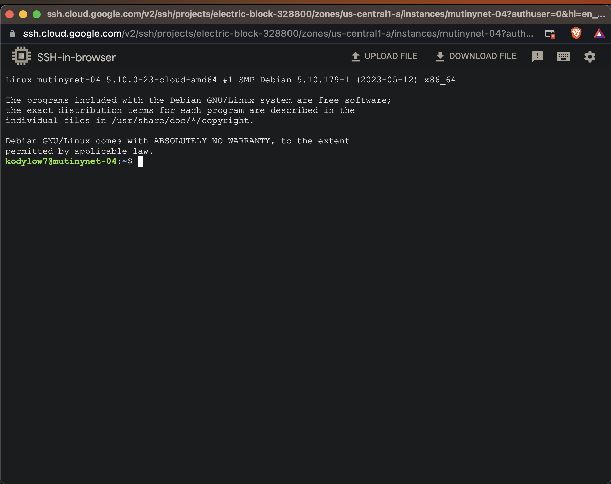
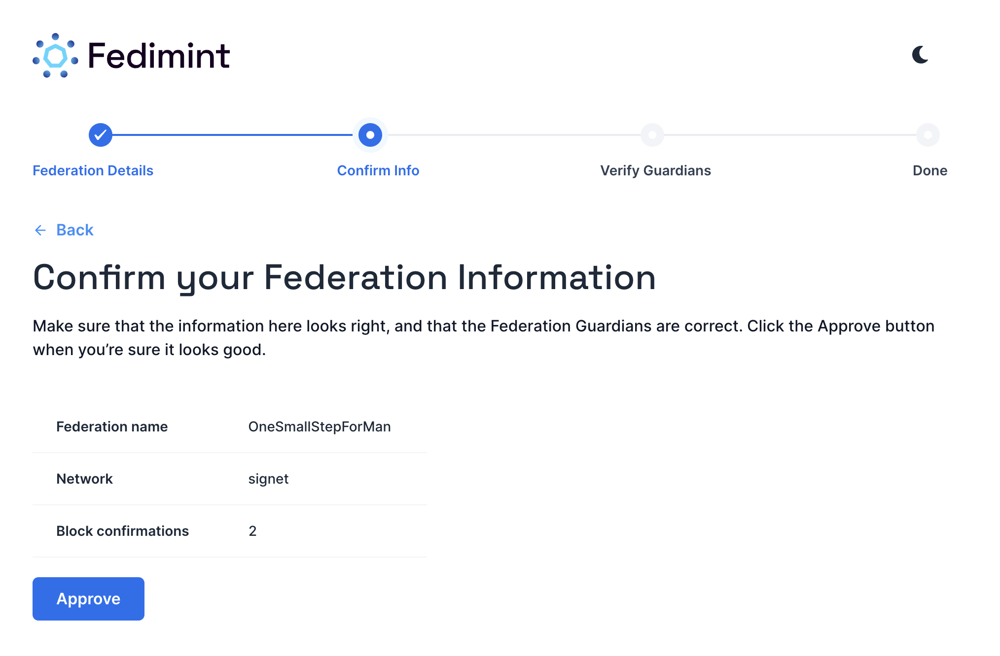
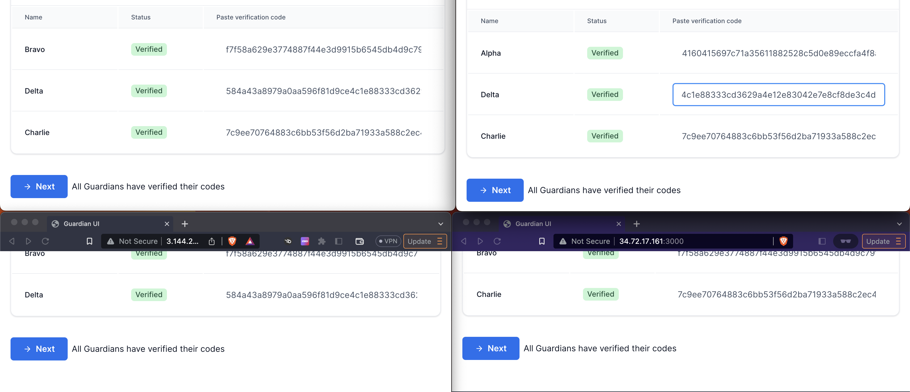
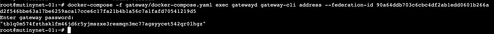
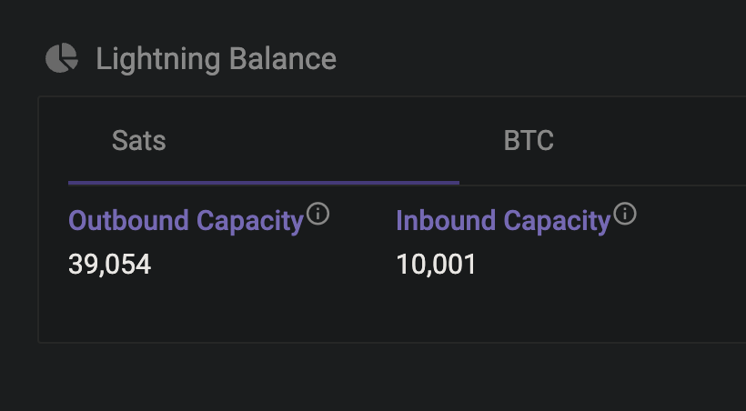

# Setting up a Federation + Lightning Gateway on Mutinynet

This is a guide for setting up a 3/4 federation + lightning gateway on mutinynet, a test network for bitcoin with 30 second block times. You can run this same setup on a different test network or on mainnet with real bitcoin, but that is not encouraged while fedimint remains under active development.

> [!WARNING]  
> Fedimint 0.1 is alpha software released under an MIT License, do not use it with real bitcoin (yet), only use regtest or test networks like mutinynet.

<p align="center">

</p>

## Step 0: What is Fedimint and how does it work?

<details>

<summary>Fedimint is a federated chaumian e-cash mint, built on bitcoin, compatible with the lightning network via gateways.

^ Click arrow for details!</summary>

1. **Federated**: fedimint attempts to minimize trust by splitting the custodian (the mint) across multiple actors who run a distributed consensus. You can run fedimint as any t/n setup (including 1/1) but we recommend you use a Byzantine Fault Tolerant configuration if possible, so `3m+1` where `m` is the number of gaurdians who can be actively malicious or compromised without impacting the federation. e.g. 3/4 for 1 compromised, 5/7 for 2 compromised, 7/10 for 3 compromised, etc.
2. **Chaumian**: Fedimint uses a blinded signature accounting system to give users near perfect privacy. This accounting system was developed by David Chaum in the late 20th century.
3. **E-cash Mint**: Users deposit bitcoin into fedimint and are issued e-cash "notes". Users then redeem those notes in exchange for bitcoin (either a withdrawal from the mint or to complete a lightning invoice payment). The chaumian e-cash system blinds the mint from its users: there isn't even a concept of a "user" to the mint, there is simply the e-cash notes, where every e-cash note is indistinguishable from every other of the same denomination.
4. **Built on Bitcoin**: the underlying reserves which are deposited and withdrawn from the fedimint are bitcoin. The e-cash notes are 1-1 backed by on-chain bitcoin held by the fedimint and are denominated in satoshis. It will eventually be possible to denominate the e-cash notes in different currencies like USD or EUR using fedimint modules.
5. **Compatible with the Lightning Network**: The e-cash mint alone is insufficient to successfully scale bitcoin. When you deposit into the mint and receive the ecash notes, the only other people who might accept that e-cash claim against bitcoin will be your mint or other users of that mint. Fedimint's compatibility with Lightning allows you to use your e-cash notes to pay lightning invoices, and to generate lightning invoices which you receive as e-cash, letting users of fedimints remain compatible with the broader bitcoin network.
6. **Via Gateways**: we call the mechanism we use for lightning network compatibility a "lightning gateway". Any user of a fedimint who also runs a lightning node can use that node to send and receive bitcoin in exchange for e-cash payments by other users of the mint. A lightning gateway can service many federations, and federations can be serviced by many lightning gateways. When a fedimint user tries to pay a lightning invoice, what they're actually doing is locking e-cash notes to a contract and advertising "Any lightning node that proves it paid this invoice can claim the e-cash". Lightning gateways servicing the federation compete to pay the invoice because they'll receive slightly more in e-cash than the value of the invoice. This gateway e-cash payment can be usefully thought of as an "extra hop" on the lightning payment's onion route, fitting with the standard economic incentives of lightning nodes.
</details>

</br>

# Let's Make a Fedimint

## Step 1. Provisioning VPS's

For this setup we'll be setting up a 3/4 Federation, then a Lightning Gateway to service the federation.

Fedimint can run with any t/n configuration including 1/1, so feel free to use any number of machines you want or just run it locally. However the power of fedimint is in the redundancy of the federation, and at the end of this guide we'll see how we can kill a machine and the federation will continue to function.

I'll be using Digital Ocean, Linode, and Amazon EC2 for this guide, but any VPS provider or your own hardware will work if it can run Linux and Docker. Feel free to use whichever you're most comfortable with or prefer. We recommend Digital Ocean for the best experience.

### 1.1. Digital Ocean Setup

<details open>
<summary>
Digital Ocean setup instructions
</summary>
- Create a new droplet, use the default parameters for a "Regular" CPU option ($12 2GB RAM/1 CPU machine).

<p align="center">

</p>

- Default Ubuntu image

<p align="center">

</p>

- `fedimintd` CAN run on the $6 1GB RAM/1 CPU machine, but for a longer running federation or one you want to be highly performant with > a couple dozen users we recommend the 2GB RAM at least.

<p align="center">

</p>

- Auth with SSH keys (recommended) or password. Digital Ocean has an excellent guide on how to set up SSH keys if you click "New SSH Key" in the "Authentication" section. It also has a great browser based console that you can use to access the box directly from the dashboard.

<p align="center">

</p>

- Finalize and create the droplet. You can create multiple droplets with the same configuration, so if you want just create your 5 droplets now for the 3/4 federation + lightning gateway and skip to section 2 to install the software. Otherwise continue to the next step to create the other machines.

<p align="center">

</p>

- You can SSH into the machine from your terminal by copying the ssh command for key or root user/password. Or just use the droplet terminal from the digital ocean console.

<p align="center">

</p>

<p align="center">

</p>

</details>

### 1.2. Linode Setup

<details>
<summary> Click here for Linode setup instructions </summary>

For the Linode Setup we'll use the same $12 2GB/1CPU machine as Digital Ocean, if you're also running the lightning gateway off of this machine you'll want to use the 4GB/2CPU machine. We'll use the same ubuntu 22 image.

<p align="center">

</p>

- Set up the root password (and SSH keys recommended)

<p align="center">

</p>

- Then create the machine.

<p align="center">

</p>

- You can SSH into the machine from your terminal by copying the ssh command for key or root user/password:

<p align="center">

</p>

<p align="center">

</p>

</details>

### 1.3. Amazon EC2 Setup

<details>
<summary> Click here for Amazon EC2 setup instructions </summary>

For the AWS EC2 Setup we'll use the free tier t2.micro machine, which is 1GB RAM/1CPU. This is below the recommended specs but for a 3/4 federation it's redundant to this machine occasionally being slow or glitching out, and at the end of this tutorial we'll kill the machine entirely and demonstrate the federation continuing to operate.

- Use your ssh keys (you'll have to import them for EC2 in the console beforehand), set a security group, and free tier EC2 lets you have up to 30GB of storage.

<p align="center">

</p>

- Then in your EC2 management console select "Connect your instance", adjust the key visibility, and you'll be able to ssh into the machine

<p align="center">

</p>

- Then you're good to connect to the machine from a terminal:

<p align="center">

</p>

</details>

### 1.4. Google Cloud Setup

<details>
<summary> Click here for Google Cloud setup instructions </summary>

For the google cloud machine we'll use something a little bigger because we'll also run the lightning gateway on it. Google VMs generate new ssh keys for you so make sure you copy those down into your local to ssh into the machine.

<p align="center">

</p>

- Then google VMs have a nice SSH button in the console that pops open a bash terminal connect to the machine.

<p align="center">

</p>

</details>

## Step 2. Installing Fedimint w/ Docker

You should now have your machines running and be able to ssh into them. We'll install fedimint on each machine using the docker install script.

Run the No TLS fedimint setup script below on each of the 4 machines you're running the fedimint guardian daemon on. Only install fedimintd on the boxes that'll run the guardians. If you're running the lightning gateway on one of the machines, you'll install the gateway setup script on that machine as well.

### Fedimint Setup Script (No TLS):

```bash
curl -sSL https://raw.githubusercontent.com/fedimint/fedimint/master/docker/download-mutinynet.sh | bash
```

or if you want to install with TLS:

```bash
curl -sSL https://raw.githubusercontent.com/fedimint/fedimint/master/docker/tls-download-mutinynet.sh | bash
```

> At any point during the setup if you run into issues, you can run this command to wipe docker for each service and start over again with the install script:
(Note: you can use the `docker-compose` command or on recent docker versions use `docker compose` instead)

```bash
# for fedimintd
docker-compose -f ./fedimintd/docker-compose.yaml down -v --rmi 'all'
# for gateway
docker-compose -f ./gateway/docker-compose.yaml down -v --rmi 'all'
```

The install script lets you install one or all of:

1. Fedimintd: The fedimint daemon, this is the only thing we're installing right now.
2. LND + Gateway: A lightning node with fedimint gateway for intercepting HTLCs to provide lightning services for the federation
3. RTL: Ride the Lightning web interface for the the lightning node

and it'll start the services on the following ports:

<!-- markdown-link-check-disable -->

- Fedimintd Guardian Dashboard: http://your.ip.add.ress:3000
- Lightning Gateway Dashboard: http://your.ip.add.ress:3001
- RTL Lightning Node Management: http://your.ip.add.ress.198:3003

<!-- markdown-link-check-enable -->

<p align="center">

</p>

<p align="center">

</p>

> If you see this pink screen, just hit TAB + ENTER to get past it.

<p align="center">

</p>

You've now got the fedimint processes running on each machine. Congratulations! However, they're not connected into a federation yet. We'll do that in the next step.

### Notes for specific machines:

- If you're running on linode or aws you'll need to install and start docker and docker compose first. You can do this by running the following commands (change apt-get to yum if not using ubuntu):

```bash
# update packages
sudo apt-get update
# add docker's gpg key
curl -fsSL https://download.docker.com/linux/ubuntu/gpg | sudo gpg --dearmor -o /usr/share/keyrings/docker-archive-keyring.gpg
# set up the stable repo for docker
echo "deb [arch=$(dpkg --print-architecture) signed-by=/usr/share/keyrings/docker-archive-keyring.gpg] https://download.docker.com/linux/ubuntu $(lsb_release -cs) stable" | sudo tee /etc/apt/sources.list.d/docker.list > /dev/null
# update packages again
sudo apt-get update
# install docker engine
sudo apt-get install docker-ce docker-ce-cli containerd.io
# start docker
sudo systemctl start docker
# enable docker startup on boot
sudo systemctl enable docker
# make a new docker group
sudo newgrp docker
# add current user to docker group
sudo usermod -aG docker $USER
# make sure you set docker socket permissions for your user
sudo chown root:docker /var/run/docker.sock
sudo chmod 660 /var/run/docker.sock
# verify docker is working
sudo systemctl status docker
# restart docker to make sure the permissions are set
sudo systemctl restart docker
```

and if you get a "platform error" when trying to install with docker compose, you can run the following commands to install the most recent version of docker compose:

```bash
sudo curl -L "https://github.com/docker/compose/releases/latest/download/docker-compose-$(uname -s)-$(uname -m)" -o /usr/local/bin/docker-compose
```

## Step 3. Forming the Federation

Now that we have the fedimint processes running on each machine, we'll form the federation by connecting them together. We'll use the fedimint guardian dashboard to do this. Go to the dashboard url for each machine, it's running on port :3000 .

> Note: If you're running on AWS = you'll need to open port 3000 in your security group to access the dashboard, and if you're running on google cloud you'll need to open both ports 3000 and 8174 in your firewall.

### Leader and Followers

On the homescreen you'll see a selection to lead or follow. This does not refer to any of the underlying security elements: all the guardians will participate in a round-robin distributed key generation once connected to generate all of the secrets and private keys required to run the mint. No guardian at any time during setup knows the complete key or secret.

The "Leader" is simply the guardian who will input the configuration settings for the federation and the "Followers" will agree to and validate those settings. This distinction is made simply for UX purposes so each guardian doesn't have to repeatedly input the same things, and when there's a typo blow up the key generation.


## Leader

The leader inputs an additional couple parameters beyond his name and password:

- Federation Name: whatever you want to name your federation
- Number of Guardians: the n of the t/n, so 4 for a 3/4 federation
- Network: use signet (mutinynet is a fork of signet with 30 second blocktimes)
- Block Confirmations: Fedimint's consensus CANNOT handle bitcoin block reorganizations (it's impossible to invalidate or distinguish e-cash once issued) so we recommend at least 6 confirmations (meaning the fedimint's consensus blockheight will be current blockheight - 6) for any mainnet or production use, but if you're just using this for development you can set it to 1 or 2

<p align="center">

</p>

Once you confirm your settings you'll see a guardian confirmation page with a "Invite Followers" websocket link. That's the link you'll send to each of the followers. Once they copy it over they'll be presented with a page to confirm the federation specifications set by the leader.

<p align="center">

</p>

## Follower

The followers simply set their names and passwords then paste the websocket link from the leader to connect. Once connected, they'll be prompted to confirm the federation info set by the leader. All the guardians have to connect and approve. Once that's done, they'll go through the distributed key generation to set up the fedimint.

<p align="center">

</p>

<p align="center">

</p>

<p align="center">

</p>

### Distributed Key Generation

<details>
<summary>
The "numbers" the guardians are running mostly involved a Distributed Key Generation (DKG). DKG is a collaborative cryptographic protocol where multiple parties generate a shared secret key without any party ever holding the full key. We use DKG for fedimint so that none of the guardians ever have the full key to the mint. This is a critical security feature of fedimint, as it means that even if a single guardian is compromised, the mint cannot be compromised.

^ Click arrow for details!

</summary>

1. Centralized Key Generation with a Dealer:
   Here, Dealer Dave will generate the key and then distribute shares of this key to the participants. This is the simplest way to generate a shared key, but it has a major drawback: if Dealer Dave is compromised, the key is compromised. This is the same as a single guardian setup in fedimint: if the guardian is compromised, the mint is compromised.

<p align="center">

</p>

2. Distributed Key Generation with No Centralized Dealer:
   To perform a distributed key generation where noone knows the complete key, four players each act as a dealer, generating their own polynomials and sharing points based on those polynomials. These points are then aggregated to form a new polynomial that no single player knows entirely.

<p align="center">

</p>

</details>
<p align="center">

</p>

## Guardian Verification

Once the distributed key generation is complete, the guardians will be prompted to verify the key generation. This is a critical step to ensure that the key generation was performed correctly and that the guardians are all in agreement on the key. If any guardian disagrees, you'll have to start over and perform the key generation again after wiping the docker containers.

<p align="center">

</p>

<p align="center">

</p>

<p align="center">

</p>

## Guardian Dashboard

- Your Federation is now set up!

<p align="center">

</p>

# Connecting and Setting up the Lightning Gateway

Now that we have the federation running, we'll set up the lightning gateway. This is a lightning node that will intercept HTLCs from the lightning network and forward them to the federation. This will allow us to provide lightning services to the federation.

Let's connect the lightning gateway cli to the federation. You can do this through the gateway dashboard running on `:3001` or through the command line. We'll use the command line here, sometimes the dashboard can be a little slow to update.

```bash

root@mutinynet-01:~# docker-compose -f gateway/docker-compose.yaml exec gatewayd gateway-cli connect-fed {{your_invite_code_here}}
Enter gateway password: #default is `thereisnosecondbest`, this is whatever you set the gateway password when you installed fedimint
{
  "federation_id": "90a64ddb703c6cbc4df2ab1edd0601b266ad2f546bbe63a17be6259aca17cce6c17fa21b4b1a56c7a1fafd70541219d5",
  "balance_msat": 0
}
```

### Funding the Gateway

You'll initially have 0 sats and ecash, but you can deposit to the gateway using the mutinynet faucet at https://faucet.mutinynet.com. Get a new address from the gateway and deposit to it:

```bash
docker-compose -f gateway/docker-compose.yaml exec gatewayd gateway-cli address --federation-id 90a64ddb703c6cbc4df2ab1edd0601b266ad2f546bbe63a17be6259aca17cce6c17fa21b4b1a56c7a1fafd70541219d5
```

<p align="center">

</p>

<p align="center">

</p>

```bash
docker-compose -f fedimintd/docker-compose.yaml exec fedimintd fedimint-cli help
```

### Lightning Gateway Dashboard

<!-- markdown-link-check-disable -->

Now that you're connected, you can go to the lightning gateway dashboard at http://your.ip.add.ress:3001 and see the gateway status.

<!-- markdown-link-check-enable -->

<p align="center">

</p>

deposit to it using the mutinynet faucet at https://faucet.mutinynet.com

<p align="center">

</p>

You'll also need to open a lightning channel from the gateway node, so get a deposit address from RTL and deposit to it using the mutinynet faucet at https://faucet.mutinynet.com:

<p align="center">

</p>

<p align="center">

</p>

Opening a channel to the fedi alpha gateway:

```
025698cc9ac623f5d1baf56310f2f1b62dfffee43ffcdb2c20ccb541f70497d540@54.158.203.78:9739
```

<p align="center">

</p>

<p align="center">

</p>

### Getting Inbound Liquidity

Send some sats through your channel to the fedi alpha signet faucet. We'll be integrating in a LSP soon to make this easier.

<p align="center">

</p>

<p align="center">

</p>

<p align="center">

</p>

<p align="center">

</p>

Your federation gateway is now ready to provide lightning services to the federation! You should be able to send and receive lightning payments to users of the federation via the gateway, give it a try using a compatible client like the fedimint-cli.

> [!WARNING]  
> Fedimint 0.1 is alpha software released under an MIT License, do not use it with real bitcoin (yet), only use regtest or test networks like mutinynet.
