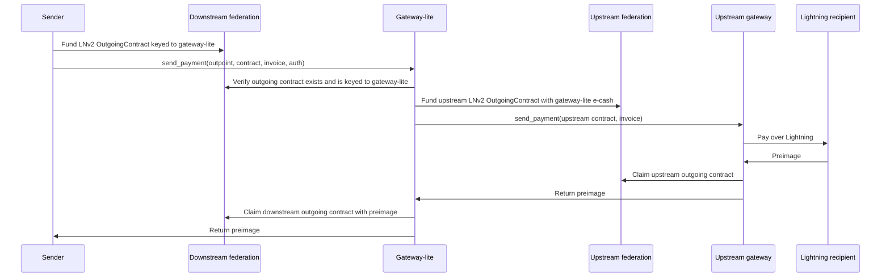
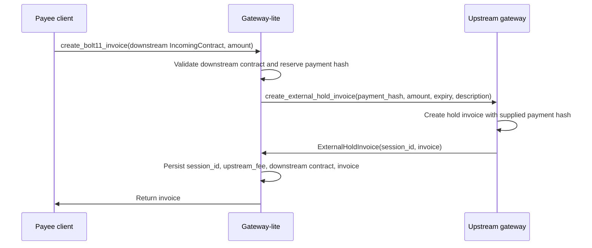
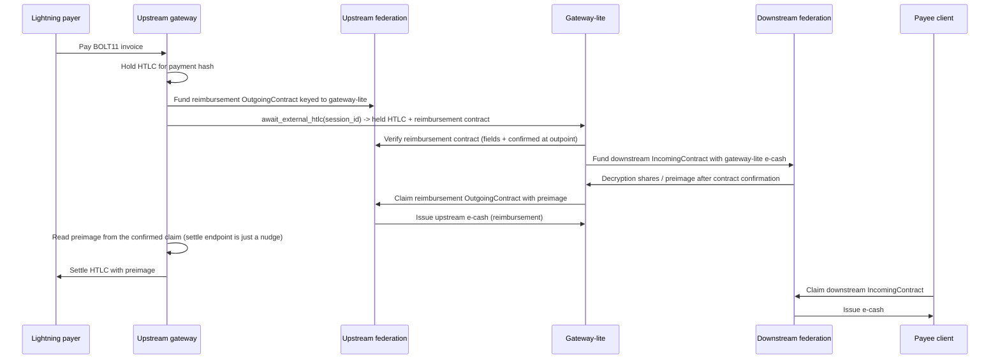

# Gateway-Lite LNv2 Proxy Spec

Status: draft

## Goal

Allow a small federation to offer Lightning send and receive without operating
its own Lightning node. A gateway-lite instance registers as an LNv2 gateway
in the small federation, but uses one or more upstream LNv2 gateways connected
to larger federations for real Lightning connectivity.

The design goal is to preserve the user-facing LNv2 trust property:

- A sender pays only if the gateway returns a valid preimage, otherwise the
  sender can refund.
- A receiver can claim e-cash from the small federation if and only if the
  small federation incoming contract was funded.
- A payer outside Fedimint only loses Lightning funds if the preimage is
  revealed.

The atomic reimbursement baseline (see Upstream Reimbursement) doesn't require
gateway-lite to trust the upstream gateway for reimbursement accounting. That
trust exists only in the optional custodial-ledger mode, and even there it's
operator risk, not user custody risk.

## Non-Goals

- LNv1 support.
- A fully atomic cross-federation asset swap between the small and upstream
  federations.
- BOLT12 support.
- Removing the need for gateway-lite to hold inventory in at least one
  federation.
- Hiding payment correlation from gateway-lite or the upstream gateway.

## Alternatives Considered

Gateway-lite is one of several ways for a small federation to offer Lightning, and
the most complex. It's only the right choice under a specific condition,
stated at the end of this section. The alternatives, ranked by increasing trust
and complexity cost:

1. Direct registration of an existing gateway (preferred when available).
   A single `gatewayd` with a real Lightning node can register with and serve
   many federations at once. The simplest solution to "small federation, no
   Lightning node" is therefore to have an existing gateway operator register
   directly with the small federation. This requires zero new code and has the
   smallest user-trust surface, because it's just a normal gateway.
   Its cost is borne by the gateway operator, not the protocol: that operator
   must join the small federation and hold e-cash inventory inside it, taking on
   the small federation's solvency and availability risk. Direct registration is
   strictly preferable whenever an operator is willing to do this.

2. Gateway-lite (this design).
   Gateway-lite exists precisely for the case where no Lightning-node operator
   will hold inventory inside the small federation. It relocates that risk: the
   small federation's own party runs gateway-lite and holds inventory in the
   larger, more-trusted upstream federation, while the upstream gateway operator
   never joins the small federation. The price is a new upstream hold API, a
   receive proxy, and double inventory. Reimbursement is atomic in the baseline,
   so it adds no reimbursement-accounting trust unless the operator opts into the
   optional custodial-ledger mode. Either way the residual is operator risk, not
   user custody risk.

3. Relaxed-trust two-payment proxy (rejected).
   A simpler proxy could use the unmodified upstream gateway: have it mint a
   normal upstream invoice into gateway-lite's own upstream client (gateway-lite
   can build that contract because it picks its own preimage), and separately
   fund the downstream contract. This needs no new upstream API. It's rejected
   because the two legs are unlinked: the external payer can pay the upstream
   invoice while gateway-lite fails or refuses to fund the downstream contract,
   so the payer loses funds and the payee receives nothing. That breaks the
   user-facing receive guarantee in the Goal section. Preserving that guarantee
   is the entire reason this design instead keys an upstream hold invoice to the
   downstream payment hash.

4. recurringd / LNURL receive extension (the structural template, not a substitute).
   The LNv2 LNURL/recurringd receive path already creates an `IncomingContract`
   on behalf of an offline party and validates a gateway-returned invoice by
   payment hash and amount, exactly gateway-lite's invoice-creation step. It's
   the right structural template to reuse for that step (deterministic contract
   construction plus invoice hash/amount validation). It isn't a substitute,
   because it still terminates at a single real-node gateway in one federation.
   The cross-federation hold settlement is the delta this design adds.

Other models don't apply: LSP/channel arrangements need a node in the small
federation to anchor a channel, and a generic atomic cross-federation e-cash
bridge would obviate the hold-invoice trick but is a stated non-goal and doesn't
exist in the codebase.

Use gateway-lite only when both hold: (a) no operator with a Lightning node is
willing to register directly with the small federation and hold inventory
there, and (b) a party associated with the small federation is willing to run
gateway-lite, hold upstream inventory, and absorb downstream solvency and
upstream reimbursement risk. If (a) is false, prefer direct registration.

## Terminology

- Downstream federation: the small federation that has no Lightning node.
- Upstream federation: the larger federation where gateway-lite holds e-cash
  and where a real gateway has Lightning liquidity.
- Upstream gateway: a normal `gatewayd` connected to a Lightning node.
- Gateway-lite: a gateway-like process that serves the downstream LNv2 public
  gateway API but has no Lightning node. Throughout this spec, "gateway-lite"
  names this role. The concrete binary that would implement it is named
  `gatewayd-lite` (paralleling `gatewayd`, the existing daemon).
- Downstream contract: an LNv2 `IncomingContract` or `OutgoingContract` in the
  downstream federation.
- External hold invoice: a BOLT11 hold invoice created by the upstream gateway
  for a payment hash supplied by gateway-lite, but not backed by an upstream
  federation incoming contract.

## Current LNv2 Anchors

This design builds on these existing LNv2 behaviors:

- Clients call `routing_info`, `create_bolt11_invoice`, and `send_payment` on a
  selected gateway.
- For receives, the client creates an `IncomingContract`, sends it to the
  gateway, and requires the returned BOLT11 invoice to use the contract payment
  hash and amount.
- A normal gateway creates that BOLT11 invoice through its Lightning node and
  records `payment_hash -> incoming contract` in gateway DB.
- When a payment reaches the normal gateway's Lightning node, the gateway funds
  the matching federation incoming contract, obtains the decrypted preimage
  from the federation, and settles the hold invoice.
- For sends, the user funds an `OutgoingContract` keyed to the selected gateway.
  The gateway returns either a valid preimage or a forfeit signature.

Gateway-lite should reuse these client-visible semantics. The main change is
that invoice creation and payment settlement are backed by an upstream gateway
instead of a local Lightning node.

## Why a New Upstream Hold API Is Needed

The hold invoice itself already exists. The gateway's Lightning backend already
creates hold invoices for a caller-supplied payment hash whose preimage it
doesn't know, holds the HTLC, and settles it later with an externally-supplied
preimage. This is exactly how normal LNv2 receive works today (`create_invoice`
with a `payment_hash` maps to LND `add_hold_invoice` / LDK `receive_for_hash`,
settled via `complete_htlc`).

What's new is only an authenticated way to drive that primitive without a local
federation contract.

The reason a local contract can't be reused is cryptographic, not incidental. In
LNv2 receive, the settlement preimage is produced by the federation
threshold-decrypting a ciphertext embedded in an `IncomingContract`.

For gateway-lite's receive, the payee builds the downstream `IncomingContract`: they
pick a preimage `P`, encrypt it under the *downstream* federation's threshold key,
and their invoice is locked to `H = sha256(P)` (the payee's client rejects any
invoice with a different hash). The external HTLC therefore arrives locked to `H`
and can be settled only with `P`.

`P` isn't secret to the payee (they chose it), and after the downstream contract is
funded it becomes recoverable by anyone with downstream-federation API access (the
decryption-share endpoint is unauthenticated). What matters here is that the
*upstream* federation can never derive it.

A normal *upstream* `IncomingContract` can't supply that `P`. It would settle by
having the *upstream* federation decrypt a ciphertext to a preimage, but the
upstream federation holds a different threshold key and can't decrypt a
ciphertext encrypted to the downstream federation.

To make the upstream federation able to produce `P`, gateway-lite would have to
encrypt `P` under the upstream key when building the contract, which requires
knowing `P` at invoice-creation time. It doesn't, and must not: anyone holding `P`
early could settle the HTLC without the payee's downstream contract ever being
funded, which is the exact property the design preserves.

So the settlement preimage must flow downstream-federation -> gateway-lite ->
upstream HTLC, and the only object that settles an HTLC from an externally
supplied preimage is a raw hold invoice. Gateway-lite reuses the existing hold
invoice. It just needs to invoke it without an upstream contract.

The new work is therefore the authenticated, contract-decoupled API surface
(create / await / settle / cancel) plus generalizing the gateway's hold-invoice
filter (`Lnv2HoldInvoiceFilter`) so an external session's held HTLC is routed to a
settle/cancel path instead of being dropped as not federation-bound. The upstream
gateway settles the held HTLC only with the preimage gateway-lite obtains from
the downstream federation.

## High-Level Architecture

Gateway-lite runs four pieces:

1. Downstream gateway server.
   Serves the existing LNv2 gateway API to downstream clients.

2. Downstream federation client.
   Holds e-cash in the downstream federation and has the gateway-lite LNv2
   module key used in downstream contracts.

3. Upstream federation client.
   Holds e-cash in the upstream federation for outgoing payments, and on proxied
   incoming payments is reimbursed by claiming an upstream `OutgoingContract` the
   upstream gateway funds (see Upstream Reimbursement).

4. Upstream hold-invoice client.
   Calls new authenticated upstream gateway endpoints to create external hold
   invoices, wait for held HTLCs, settle (by claiming the reimbursement contract,
   which reveals the preimage to the gateway), or cancel.

Gateway-lite can be implemented as either:

- a new `gatewayd --mode lite` that disables Lightning RPC and swaps in a lite
  `IGatewayClientV2` implementation; or
- a separate `gatewayd-lite` binary that reuses the gateway client builder,
  router helpers, and LNv2 gateway client modules.

The first implementation should prefer a separate mode or binary with explicit
configuration. Silent fallback from full gateway mode to lite mode is unsafe.

## Downstream Gateway Registration

Gateway-lite registers with the downstream federation as an LNv2 gateway.

The advertised `RoutingInfo` MUST use:

- `module_public_key`: gateway-lite's downstream LNv2 module public key.
- `receive_fee`: downstream receive fee plus upstream external-hold fee plus
  gateway-lite margin.
- `send_fee_default`: downstream claim fee plus upstream send fee plus
  gateway-lite margin.
- `send_fee_minimum`: initially equal to `send_fee_default`.
- `expiration_delta_default`: enough time for downstream contract confirmation,
  upstream payment attempt, and gateway-lite retry.
- `expiration_delta_minimum`: only lower than default once direct downstream
  swaps are payment-hash-aware.

Compatibility note: current clients use `RoutingInfo.lightning_public_key` to
guess when an invoice can be direct-swapped through a gateway. Gateway-lite
receives invoices signed by the upstream Lightning node, so using the upstream
node pubkey here can produce false direct-swap matches for unrelated upstream
invoices. The initial gateway-lite implementation SHOULD either:

- advertise a stable synthetic public key not used by the upstream Lightning
  node; or
- advertise the upstream public key only if `send_fee_minimum ==
  send_fee_default` and gateway-lite treats unknown local payment hashes as
  upstream Lightning payments rather than hard direct-swap errors.

A later client/gateway API can add explicit `can_settle_payment_hash` discovery
to recover cheap direct downstream swaps without relying on invoice payee keys.

## Timing and Expiration Model

Gateway-lite spans two federations and a Lightning hop, which use three
different and independently moving clocks. The spec MUST reason about them on a
common wall-clock basis rather than comparing raw values. An abstract "enough
time" isn't sufficient for a two-hop proxy.

The three clocks:

- Downstream `OutgoingContract.expiration` (send): a downstream-federation
  block height. A normal gateway turns it directly into a Lightning CLTV budget
  via `max_delay = expiration - EXPIRATION_DELTA_MINIMUM_V2` (144 blocks).
- Downstream `IncomingContract` expiration (receive): for ordinary receives, a
  downstream-federation unix timestamp in seconds (funding is rejected if it's
  already in the past). Note the contract field is `expiration_or_fee` and is
  **overloaded**. LNURL-style receives encode the gateway fee there instead of an
  expiry. The gateway-lite receive MVP supports only ordinary receive contracts
  carrying a real unix expiration, and MUST NOT run timing checks against a
  fee-encoded `expiration_or_fee`.
- Upstream HTLC deadline: a CLTV expiry on the upstream Lightning node (LND) or
  the LDK `claim_deadline`, after which the node force-fails or force-closes the
  HTLC regardless of gateway-lite. It's set by the incoming HTLC, not chosen by
  gateway-lite or the upstream gateway.

Conversions MUST use explicit, configured assumptions: `DOWNSTREAM_BLOCK_SECS`
and `UPSTREAM_BLOCK_SECS` (assumed seconds per block on each chain), plus a
safety margin covering downstream funding confirmation, decryption-share
retrieval, the upstream settle round-trip, and clock skew.

### Send timing

The downstream `OutgoingContract.expiration` (block height) bounds the entire
upstream attempt. Gateway-lite MUST convert the remaining downstream block
budget to wall-clock, subtract the safety margin, and require that the full
upstream send lifecycle completes within it:

```text
wallclock(downstream_outgoing_expiration)
  >= now
   + upstream_funding_time
   + upstream_payment_time
   + downstream_claim_confirmation_time
   + margin
```

The upstream contract expiration and the upstream final-hop CLTV MUST both be
bounded by this downstream deadline. If it can't be met, gateway-lite MUST
return a forfeit signature (`TimeoutTooClose`) before attempting upstream, so
the sender refunds. If gateway-lite attempts upstream anyway and the preimage
arrives after the downstream contract has expired and the sender has already
refunded, gateway-lite has paid upstream and can't claim downstream, a
gateway-lite loss (see Failure Handling).

### Receive timing

The upstream HTLC deadline bounds the entire downstream funding-and-decrypt
cycle. Gateway-lite MUST NOT fund the downstream `IncomingContract` unless:

```text
wallclock(upstream_htlc_deadline)
  >= now
   + downstream_funding_confirmation_time
   + downstream_decryption_share_retrieval_time
   + upstream_settle_round_trip
   + margin
```

This is stricter than "enough time to settle": the time to *obtain* the
preimage (funding confirmation plus threshold decryption) is separate from, and
usually larger than, the time to settle. Omitting it makes the
funded-but-cancelled-upstream operator-loss case common rather than rare for a
slow downstream federation.

The upstream HTLC deadline MUST come from the actual
incoming HTLC's CLTV expiry / LDK `claim_deadline`, not from `max_hold_secs`
(which is only an upper bound above which the upstream MAY reject creation).
`ExternalHtlc` carries that expiry as a raw block height
(`htlc_claim_expiry_height`, with `observed_block_height`). Gateway-lite converts
it to wall-clock with its own configured block-time assumptions rather than
trusting a gateway-side conversion.

The reimbursement `OutgoingContract` adds a second, intermediate deadline that
gateway-lite MUST also respect. LNv2 rejects a claim at or after the contract's
expiration, so the contract must stay live long enough for gateway-lite to fund
downstream, obtain the preimage, and get its claim confirmed, yet expire early
enough that the upstream gateway can still settle the HTLC afterwards:

```text
now + downstream_funding_confirmation_time
    + downstream_decryption_share_retrieval_time
    + upstream_claim_confirmation_time
    + margin
  <= wallclock(reimbursement_expiration)
  <= wallclock(upstream_htlc_deadline) - settle_margin
```

The lower bound protects gateway-lite (claim before the contract expires). The
upper bound protects the upstream gateway (settle before the HTLC deadline).
Gateway-lite verifies both before funding downstream (see Receive Requirements).

Open Question 4 (maximum safe upstream hold) is a design constraint, not a
polish item. The hold must satisfy a band, not a single bound: `max_hold_secs`
MUST be at least the measured worst-case budget (downstream funding confirmation
+ decryption-share retrieval + settle round-trip + margin) so the receive can
actually complete, and at the same time below the upstream node's
force-fail/force-close policy so the node doesn't kill the HTLC. LDK in
particular offers no long-hold guarantee beyond `claim_deadline`, so if that band
is empty on a backend (the confirm-plus-decrypt-plus-settle budget exceeds what
the node will hold), the first implementation SHOULD restrict the upstream
backend to LND or refuse the receive rather than fund into a hold that can't
complete.

## Send Flow

### Happy Path



Note the symmetry with receive (see Upstream Reimbursement): on send, gateway-lite
funds an upstream `OutgoingContract` keyed to the upstream gateway, and the
upstream gateway claims it by revealing the preimage it got from paying the real
invoice. On receive the roles flip. The upstream gateway funds the
`OutgoingContract` keyed to gateway-lite, and gateway-lite claims it by revealing
the preimage it got from the downstream federation. Both directions reuse the
same LNv2 `OutgoingContract` primitive.

### Send Requirements

Gateway-lite MUST validate the downstream `SendPaymentPayload` with the same
checks a normal LNv2 gateway performs:

- contract is keyed to gateway-lite's downstream module public key;
- invoice authorization signature is valid;
- downstream outgoing contract is confirmed;
- invoice hash and amount match the downstream contract;
- downstream contract amount is at least the amount plus the advertised fee;
- the contract expiration leaves enough time for the upstream attempt.

Gateway-lite then chooses one of these settlement paths:

1. Downstream direct swap.
   If the invoice payment hash is registered as an unresolved downstream
   gateway-lite receive, fund the matching downstream incoming contract and use
   the resulting preimage to claim the downstream outgoing contract. Taking this
   path resolves that receive internally, so gateway-lite MUST first cancel or
   terminally close the matching upstream external hold session (moving it out of
   `WaitingForHeldHtlc`) before returning the preimage, and MUST handle the race
   where an upstream HTLC is already held: if that HTLC can't be cancelled,
   gateway-lite MUST NOT take the direct-swap path and instead lets the upstream
   receive path proceed. Otherwise the upstream hold invoice stays live and a
   later external Lightning payer could pay it and be charged with no
   corresponding downstream funding. The first implementation MAY simply disable
   direct swaps for gateway-lite receives until this coordination is in place.

2. Upstream Fedimint send.
   Use the upstream federation client to perform a normal LNv2 send through the
   upstream gateway. On success, use the returned preimage to claim the
   downstream outgoing contract.

3. Cancellation.
   Distinguish pre-state-machine validation failures from in-flight failures.
   The validation checks above (wrong gateway key, invalid auth, unconfirmed
   outgoing contract, invoice hash/amount mismatch) are client programming
   errors: gateway-lite MUST reject them with an error and MUST NOT produce a
   forfeit signature, mirroring the normal gateway, which only signs a forfeit
   after the cancellable state machine exists. Only in-flight conditions resolve
   to a gateway-lite forfeit signature so the sender can refund: the upstream
   send fails, or the downstream expiration is too close to attempt upstream
   safely (see Timing and Expiration Model).

### Send State Machine

Gateway-lite should model send as a durable state machine:

```text
Validating
  -> DownstreamDirectSwap
  -> UpstreamFunding
  -> UpstreamPaying
  -> AwaitingUpstreamTerminal
  -> ClaimingDownstream
  -> Success

Validating | UpstreamFunding
  -> Cancelling
  -> Cancelled

AwaitingUpstreamTerminal
  -> ClaimingDownstream            (upstream returned a preimage)
  -> Cancelling                    (only after a terminal upstream failure
                                    that can no longer reveal a preimage)
  -> Cancelled
```

The state machine MUST be idempotent by downstream contract id. Repeated
`send_payment` calls for the same contract return the same final response or
resume the same in-flight operation.

"Forfeit signature returned" and "downstream contract claimed with preimage"
MUST be mutually exclusive terminal states. The downstream federation consumes
the `OutgoingContract` only once, so it can't be both claimed and refunded. The
hazard is gateway-lite committing to a forfeit while an upstream payment it has
already triggered can still reveal a preimage, leaving gateway-lite paid upstream
but unable to claim downstream (or, conversely, returning a forfeit for a send
that actually succeeded).

A forfeit is therefore legal in only two situations: before the upstream payment
is triggered (states `Validating` and `UpstreamFunding`), or in
`AwaitingUpstreamTerminal` after the upstream attempt has reached a terminal
failure that can no longer reveal a preimage. While the upstream outcome is
undetermined (`UpstreamPaying`, and `AwaitingUpstreamTerminal` before a terminal
result), gateway-lite MUST NOT forfeit: "abandon the in-flight upstream payment"
isn't a protocol guarantee, because the payment may still settle and reveal the
preimage. Gateway-lite waits for the upstream terminal result, then claims
downstream on a preimage or forfeits on a no-preimage failure.

Forfeiting downstream is always safe for the sender, but recovering gateway-lite's
own upstream e-cash isn't always immediate. Once gateway-lite has submitted the
upstream `OutgoingContract`, refunding it before its expiration requires an
upstream-gateway forfeit signature (`OutgoingWitness::Cancel`). A unilateral
refund only works after expiry. So a forfeit in `UpstreamFunding` after the
upstream contract is submitted can strand gateway-lite e-cash until that contract
is cancelled or expires. That's operator liquidity risk, not downstream user
risk.

## Receive Flow

Receive is the core of the better design. Gateway-lite never asks the upstream
federation to decrypt the downstream preimage. Instead, the upstream gateway
creates a hold invoice for the downstream payment hash and waits for gateway-lite
to provide the preimage.

Gateway-lite's reimbursement and the publication of `P`
to upstream consensus are a single atomic step that mirrors send: the upstream
gateway funds an upstream LNv2 `OutgoingContract` keyed to gateway-lite, and
gateway-lite claims it with the downstream-derived preimage (see Upstream
Reimbursement). The actual HTLC settlement is an asynchronous, deadline-sensitive
follow-up the upstream gateway performs from that published preimage.

### Invoice Creation



Gateway-lite MUST verify before returning the invoice:

- downstream contract verifies;
- downstream contract refund key is gateway-lite's module public key;
- downstream contract payment image is `PaymentImage::Hash(h)`, where `h` is the
  invoice payment hash (that is, `h == sha256(preimage)`);
- downstream contract amount equals `invoice_amount - advertised_receive_fee`;
- upstream invoice payment hash equals the downstream payment hash;
- upstream invoice amount equals the requested amount;
- upstream invoice expiry is no longer than the downstream contract expiration
  minus a safety margin;
- the local reservation for the payment hash is durable.

Invoice creation MUST be idempotent by downstream contract id or payment hash.
Gateway-lite MUST persist the negotiated `upstream_fee` from `ExternalHoldInvoice`
in its receive session, so a restart can't recompute a different fee and break
the later reimbursement-amount check. If an existing reservation uses the same
payment hash with a different contract, amount, description, expiry, or
`upstream_fee`, gateway-lite MUST reject the request as a conflict.

If gateway-lite crashes after creating the upstream invoice but before saving
the local record, the upstream invoice expires harmlessly. If it crashes after
saving the local record but before returning the response, retrying returns the
same stored invoice.

### Payment Settlement



### Receive Requirements

Gateway-lite MUST NOT provide the preimage to the upstream gateway before the
downstream incoming contract has been accepted and the downstream federation has
returned a valid preimage for that contract.

Gateway-lite MUST NOT fund the downstream incoming contract if:

- the reimbursement `OutgoingContract` in `ExternalHtlc` does not verify (below);
- the upstream HTLC has too little time left to obtain the preimage and settle
  (see Timing and Expiration Model: this budgets downstream funding confirmation
  and decryption-share retrieval, not only settle latency);
- the downstream contract is expired or too close to expiry;
- gateway-lite lacks downstream e-cash balance;
- the held HTLC amount does not equal the invoice amount;
- the held HTLC payment hash does not equal the downstream contract payment
  hash.

Gateway-lite MUST NOT trust the upstream gateway's word about the reimbursement
contract. The federation API exposes only `(contract_id, remaining_blocks)` for an
outpoint (the second value is `expiration - consensus_block_count`, not the absolute
height), not the contract body, so gateway-lite reconstructs and verifies the
full `OutgoingContract` returned in `ExternalHtlc`. Before funding downstream it
MUST check that:

- `claim_pk` is gateway-lite's own upstream LNv2 module key (so it can actually
  claim the contract);
- `payment_image == PaymentImage::Hash(payment_hash)`;
- `amount` equals the expected reimbursement (`htlc amount - upstream_fee`);
- `expiration`, converted to wall-clock, falls inside the safe two-sided window
  `now + downstream_funding + decrypt + upstream_claim_confirm + margin <=
  reimbursement_expiration <= htlc_deadline - settle_margin`
  (see Timing and Expiration Model). The lower bound protects gateway-lite: LNv2
  rejects a claim at or after the contract's expiration, so a too-early
  expiration would let gateway-lite fund the payee downstream and then be unable
  to claim its reimbursement, operator loss. The upper bound is the upstream
  gateway's settle-in-time invariant. Gateway-lite MUST NOT fund downstream
  unless the expiration satisfies the lower bound;
- the federation confirms it at `reimbursement_outpoint`: the
  `outgoing_contract_expiration(reimbursement_outpoint)` endpoint returns a
  `(contract_id, remaining_blocks)` pair (the second value is
  `expiration - consensus_block_count`, not the absolute height), and the
  returned `contract_id` equals `contract.contract_id()`. Since `contract_id`
  commits every `OutgoingContract` field, a matching id validates the whole
  contract body. Gateway-lite uses the full contract from `ExternalHtlc` for the
  absolute-expiration / wall-clock check and `remaining_blocks` to confirm the
  contract is funded and not already expired.

If any check fails, gateway-lite MUST NOT fund downstream. It lets the upstream
HTLC expire or cancels it, and no one is charged. A buggy or malicious upstream
gateway therefore can't induce gateway-lite to fund a payee against a
reimbursement contract it can't claim.

Once gateway-lite funds the downstream contract, the payee can claim even if
gateway-lite later fails to settle upstream. That failure is gateway-lite
operator loss and is the mechanism that protects the user.

### Receive State Machine

Gateway-lite should model receive settlement as a durable state machine:

```text
InvoiceReserved
  -> UpstreamInvoiceCreated
  -> WaitingForHeldHtlc
  -> FundingDownstreamContract
  -> WaitingForDownstreamPreimage
  -> ClaimingUpstreamReimbursement   (claim the upstream OutgoingContract with P;
                                     the claim reveals P and the upstream gateway
                                     settles the held HTLC)
  -> Settled

WaitingForHeldHtlc
  -> Expired
  -> DirectSwapResolved -> CancelUpstreamHtlc -> Cancelled
       (a downstream send paid this receive internally; the upstream hold MUST
       be cancelled before the preimage is released. If the upstream HTLC is
       already held, the direct swap MUST NOT be taken.)

FundingDownstreamContract
  -> CancelUpstreamHtlc -> Cancelled      (federation rejected funding; no
                                          contract funded, so no loss)

WaitingForDownstreamPreimage | ClaimingUpstreamReimbursement
  -> OperatorLoss                         (downstream already funded; an upstream
                                          cancel or expiry now leaves the payee
                                          able to claim and gateway-lite bearing
                                          the loss)

ClaimingUpstreamReimbursement
  -> ClaimUnknown
  -> retry claim until confirmed, or until the earlier of the reimbursement
     contract expiration and the HTLC settle-safe deadline
       (the claim cutoff is the reimbursement OutgoingContract.expiration — LNv2
       rejects a claim once expiration <= consensus_block_count — so retrying past
       it only wastes effort. The claim is idempotent by reimbursement contract
       id, and it is what both reimburses gateway-lite and reveals P, so there is
       no separate "credited" step that can fail)
```

The state machine MUST be idempotent by upstream `session_id` and downstream
contract id. A repeated upstream HTLC notification for the same session resumes
the same downstream funding attempt.

## New Upstream Gateway API

The upstream external hold API is authenticated gateway-to-gateway API. It
should live alongside the LNv2 gateway API but not be used by ordinary clients.

Suggested endpoint constants:

```rust
pub const CREATE_EXTERNAL_HOLD_INVOICE_ENDPOINT: &str = "/external_hold/create_invoice";
pub const AWAIT_EXTERNAL_HTLC_ENDPOINT: &str = "/external_hold/await_htlc";
pub const SETTLE_EXTERNAL_HTLC_ENDPOINT: &str = "/external_hold/settle";
pub const CANCEL_EXTERNAL_HTLC_ENDPOINT: &str = "/external_hold/cancel";
```

Suggested request/response types:

```rust
pub struct CreateExternalHoldInvoicePayload {
    pub requester: PublicKey,              // auth identity (allowlist); signs `auth`
    pub reimbursement_claim_pk: PublicKey, // gateway-lite's upstream LNv2 module key
                                           // that will claim the reimbursement contract
    pub idempotency_key: sha256::Hash,
    pub payment_hash: sha256::Hash,
    pub amount: Amount,
    pub description: Bolt11InvoiceDescription,
    pub expiry_secs: u32,
    pub max_hold_secs: u32,
    pub auth: Signature,
}

pub struct ExternalHoldInvoice {
    pub session_id: sha256::Hash,
    pub invoice: Bolt11Invoice,
    // The negotiated fee. BOTH sides MUST persist it (the upstream session and
    // gateway-lite's receive session) so a restart cannot recompute a different
    // fee and break idempotency or the reimbursement-amount check; idempotent
    // create retries MUST return this same value.
    pub upstream_fee: Amount,
    // Create-time estimate only (from max_hold_secs), NOT an actionable deadline.
    // The funding decision uses ExternalHtlc.htlc_claim_expiry_height instead.
    pub max_hold_deadline_estimate: SystemTime,
}

pub struct ExternalHtlc {
    pub session_id: sha256::Hash,
    pub payment_hash: sha256::Hash,
    pub amount: Amount,
    // The accepted HTLC's CLTV expiry as a raw absolute block height, plus the
    // upstream chain height at which it was observed. The wall-clock conversion is
    // deliberately NOT done in the gateway: gateway-lite applies its own configured
    // block-time assumptions from the timing model, so the deadline boundary stays
    // auditable and lives in one place.
    pub htlc_claim_expiry_height: u32,
    pub observed_block_height: u32,
    // Baseline settlement: the upstream gateway has funded this upstream LNv2
    // OutgoingContract keyed to gateway-lite, with payment_image = Hash(payment_hash)
    // and amount = htlc amount - upstream_fee. Gateway-lite claims it with the
    // downstream-derived preimage to be reimbursed and to reveal the preimage.
    // The FULL contract is included, not just its outpoint: the federation API
    // exposes only (contract_id, expiration) for an outpoint, so gateway-lite must
    // reconstruct and verify every field locally and confirm contract_id against
    // the federation before funding downstream (see Receive Requirements).
    pub reimbursement_outpoint: OutPoint,
    pub reimbursement_contract: OutgoingContract,
}

// Notification only, carrying no preimage and no settlement authorization. The
// upstream gateway settles the held HTLC from the preimage P it reads out of the
// CONFIRMED reimbursement-contract claim in upstream consensus (await_preimage),
// not from this call. Deliberately omitting a raw-preimage field removes the
// unsafe path entirely: there is no way to hand the gateway P out-of-band before
// the claim is final. This endpoint only nudges the gateway to check the session
// and can speed settlement once the claim is confirmed. The `credited` fields
// below apply only to the optional custodial-ledger mode (see Upstream
// Reimbursement); in the baseline, reimbursement is the claimed contract amount,
// with no separate credit.
pub struct SettleExternalHtlcPayload {
    pub session_id: sha256::Hash,
    pub auth: Signature,
}

pub enum SettleExternalHtlcResponse {
    Settled {
        settlement_id: sha256::Hash,
        credited: Amount,
    },
    AlreadySettled {
        settlement_id: sha256::Hash,
        credited: Amount,
    },
    NoConfirmedClaim, // no confirmed reimbursement-contract claim to read P from yet
    TooLate,          // the held HTLC deadline has already passed
}

pub struct CancelExternalHtlcPayload {
    pub session_id: sha256::Hash,
    pub reason: String,
    pub auth: Signature,
}
```

The `max_hold_deadline_estimate` in `ExternalHoldInvoice` is a create-time
upper-bound estimate only, derived from `max_hold_secs`. The real deadline is
unknowable until a payer HTLC arrives. Once the HTLC is held, gateway-lite MUST make its downstream
funding decision against the wall-clock deadline it derives from
`ExternalHtlc.htlc_claim_expiry_height`, not the create-time estimate (see Timing
and Expiration Model).

Producing that raw height requires extending the Lightning
backend: the current intercept event carries the invoice expiry, not the accepted
HTLC's CLTV claim deadline (on LND, `InterceptPaymentRequest.expiry` is set from
the invoice's `hold.expiry`), so the backend MUST be extended to surface the
accepted HTLC's CLTV expiry as a block height before this safety bound can be
computed. This is a **hard MVP prerequisite for LND-backed receive**: until the LND
backend surfaces the accepted HTLC's CLTV deadline, a gateway-lite on LND MUST NOT
fund a downstream contract against an external hold. (LDK already passes
`claim_deadline` into the intercept event and is unaffected.)

Authentication can start with a configured public key allowlist on the upstream
gateway. Each request signs a domain-separated hash of the request body. A
future version can replace this with macaroon-like scoped tokens.

The upstream gateway MUST:

- create hold invoices only for authenticated gateway-lite requesters;
- enforce per-requester amount, count, and expiry limits;
- make `create_external_hold_invoice` idempotent by `(requester,
  idempotency_key)`, persist the negotiated `upstream_fee` in the session, and
  return that same `upstream_fee` on every retry;
- when the HTLC is held, fund a reimbursement `OutgoingContract` with `claim_pk =
  reimbursement_claim_pk` (the requester's declared claim key, distinct from its
  auth identity), `payment_image = Hash(payment_hash)`, and `amount = htlc amount
  - upstream_fee`, whose expiration falls in the safe two-sided window, late
  enough for gateway-lite to fund, decrypt, and claim, and early enough to settle
  the HTLC afterward (see Timing and Expiration Model), and return the full
  contract and its outpoint in `ExternalHtlc`;
- settle the held HTLC only from the preimage read out of a confirmed
  reimbursement-contract claim in upstream consensus (`await_preimage`), and only
  if `sha256(preimage)` equals the session's payment hash. The `settle` endpoint
  is a notification that carries no preimage, so there is no path to settle from a
  raw out-of-band preimage before the claim is accepted;
- set the reimbursement contract's block-height expiration conservatively from
  the held HTLC deadline (see Timing and Expiration Model) so any claim the
  federation still accepts leaves time to settle the HTLC;
- settle or cancel the held HTLC exactly once, and on cancel refund the
  reimbursement contract or wait for its expiry.

## Upstream Reimbursement

On receive, the upstream gateway gains Lightning value when it settles the
external hold invoice, while gateway-lite spent downstream e-cash to fund the
payee. Reimbursement doesn't need a new mechanism: it's the mirror image of a
send, using the existing LNv2 `OutgoingContract` primitive.

When the upstream gateway holds the inbound HTLC for payment hash `H`, it funds
an upstream `OutgoingContract` keyed to gateway-lite, with `payment_image =
Hash(H)` and `amount = htlc_amount - upstream_fee`. After gateway-lite funds the
downstream contract and learns the preimage `P` from the downstream federation,
it claims that contract with `OutgoingWitness::Claim(P)`. That single claim does
both jobs atomically:

1. it pays gateway-lite the contract amount in upstream e-cash (reimbursement),
   idempotent by the reimbursement contract id; and
2. it writes `P` into upstream consensus, so the upstream gateway extracts it and
   settles the held HTLC.

Gateway-lite can't be reimbursed without revealing `P`, and (under the
precondition below) can't be cheated of reimbursement after revealing it,
because the reveal and the payment are the same federation transaction. This is
exactly the send flow run backwards: on send gateway-lite funds the
`OutgoingContract` and the upstream gateway claims it with the preimage from
Lightning. On receive the upstream gateway funds the `OutgoingContract` and
gateway-lite claims it with the preimage from the downstream federation.

**Precondition: the upstream settles only from the claim.** The atomicity above
holds only if the upstream gateway settles the held HTLC *exclusively* from the `P`
published by gateway-lite's confirmed reimbursement claim (via `await_preimage`).

`P` isn't otherwise secret. The payee chose it. After downstream funding it's
recoverable by anyone with downstream-federation API access (the decryption-share
endpoint is unauthenticated). And any LN backend settles a hold invoice from a raw
preimage.

So a malicious or buggy upstream gateway that obtains `P` out-of-band
(from the payee, the downstream API, logs, or a compromised gateway-lite) could
settle the HTLC *without* the reimbursement claim, then let the reimbursement
contract expire and refund it. Gateway-lite loses the reimbursement. That's
gateway-lite operator reimbursement loss, not downstream-user custody loss, but it means "cannot be
cheated of reimbursement" is a precondition on upstream behavior, not an
unconditional guarantee.

The MVP states this as an explicit upstream-gateway
requirement (settle only from the published claim preimage). A hardened version
would bind settlement to the claim so raw-preimage settlement can't bypass it.

This baseline removes both forms of trust the earlier drafts introduced: there's
no custodial ledger gateway-lite must trust, and no bespoke e-cash transfer
protocol. It adds no new contract type and no ledger, but it isn't free code: the
existing send helpers build contracts keyed to the gateway's own key and the
gateway send path expects `claim_pk` to be its own, so the upstream gateway needs
new code to fund a contract keyed to a third party (gateway-lite) and to watch
that contract's claim for the revealed preimage. That's still lighter than a
ledger plus reliable-transfer plumbing, and it eliminates the "upstream settles
but does not credit gateway-lite" failure mode entirely.

Timing is an upstream-gateway safety invariant enforced by gateway policy, not by
the contract. The `OutgoingContract` only checks its own block-height expiration:
the federation permits a claim while `expiration > consensus_block_count` and a
refund only after expiry. Nothing in the contract ties this to the held HTLC's
CLTV deadline. The upstream gateway MUST therefore set the reimbursement
contract's expiration by conservatively converting the HTLC deadline to upstream
block height (see Timing and Expiration Model) and subtracting settle margin, so
that any claim the federation still accepts leaves it able to settle the HTLC.

If the gateway sets it too late, gateway-lite can claim (be reimbursed and reveal
`P`) after the HTLC can no longer be settled. That's an upstream-gateway loss,
not a user or gateway-lite loss. If gateway-lite never claims, the gateway refunds
the contract after expiry and fails the held HTLC, and no one is charged.

Optional custodial ledger (efficiency mode). Funding and claiming a contract per
receive costs an extra upstream-federation transaction and briefly locks the
gateway's e-cash. Operators who explicitly accept counterparty trust MAY instead
run a credit ledger: the upstream gateway records a balance for gateway-lite on
settlement, batching the e-cash movement and avoiding the per-receive contract.
This is an optimization over the atomic baseline, not the default, and it
reintroduces exactly the accounting trust the baseline avoids.

## Liquidity Model

Gateway-lite needs inventory on both sides:

- Downstream balance is needed to fund payee incoming contracts on receives.
- Upstream balance (or upstream credit, in custodial-ledger mode) is needed to
  pay outgoing Lightning invoices on sends.

Traffic naturally shifts inventory:

- Downstream sends consume upstream balance and increase downstream balance.
- Downstream receives consume downstream balance and increase upstream balance
  (or upstream credit, in custodial-ledger mode).

Gateway-lite SHOULD expose admin metrics:

- downstream available balance;
- upstream available balance;
- upstream credit balance (custodial-ledger mode only);
- max send amount;
- max receive amount;
- pending external holds;
- downstream contracts funded but not reimbursed upstream;
- upstream settlements credited but not withdrawn (custodial-ledger mode only).

Gateway-lite MUST refuse or stop advertising capacity when either side is below
the configured reserve.

## Fee Model

Gateway-lite fees MUST be explicit and conservative, and they MUST fit inside
the same protocol caps that ordinary downstream clients hard-enforce. This is
the binding constraint on gateway-lite economics, and it's easy to miss
because a single-hop gateway rarely approaches the caps.

Downstream clients reject any gateway whose advertised fees exceed:

- `PaymentFee::SEND_FEE_LIMIT` = 1.5% + 100 sat (send);
- `PaymentFee::RECEIVE_FEE_LIMIT` = 0.5% + 50 sat (receive).

One caveat on how that cap is enforced today: the client check is `fee.le(&LIMIT)`,
and `PaymentFee` derives `PartialOrd` with field order `(base, parts_per_million)`,
so the comparison is **lexicographic**, not component-wise. A fee whose `base` is
below the limit's base passes regardless of how large its `parts_per_million` is.
Gateway-lite MUST therefore self-enforce a component-wise bound
(`base <= limit.base && ppm <= limit.ppm`) rather than rely on the client check,
and the upstream client cap itself should be fixed to compare component-wise.

A gateway-lite quote stacks an upstream fee, a downstream fee, and a margin into
that one cap:

```text
send_fee_default =
  upstream_send_fee_estimate     # itself bounded only by SEND_FEE_LIMIT upstream
  + downstream_claim_fee
  + gateway_lite_margin
  <= SEND_FEE_LIMIT              # else clients still select gateway-lite, then fail with GatewayFeeExceedsLimit

receive_fee =
  upstream_external_hold_fee     # see bound below
  + downstream_funding_fee
  + gateway_lite_margin
  <= RECEIVE_FEE_LIMIT           # else clients still select gateway-lite, then fail with GatewayFeeExceedsLimit
```

Because the upstream send fee is itself bounded only by `SEND_FEE_LIMIT`, a
proxied send only fits when the upstream gateway charges well below the cap. In
the default configuration this is comfortable: the upstream `send_fee_default`
is roughly `TRANSACTION_FEE_DEFAULT` doubled (about 4 sat + 6000 ppm), leaving
most of the 100 sat + 15000 ppm budget for the downstream fee and margin. But
for the expensive upstream Lightning routes that justify a non-trivial default
fee in the first place, `upstream_send_fee_estimate` can approach the cap on its
own, and any stacked downstream fee then overflows it. When that happens the
client still selects gateway-lite (selection is reachability-based, not
fee-aware) and then rejects the over-cap send or receive with a
`GatewayFeeExceedsLimit` error rather than treating it as merely more expensive.

The `upstream_external_hold_fee` is a new charge that doesn't flow through the
upstream federation's normal `receive_fee` / transaction-fee model, because the
external hold invoice is deliberately not backed by an upstream
`IncomingContract`. It MUST therefore be explicitly bounded by the upstream
gateway and surfaced to gateway-lite, and gateway-lite MUST ensure
`upstream_external_hold_fee + downstream_funding_fee + gateway_lite_margin <=
RECEIVE_FEE_LIMIT`. Otherwise the advertised `receive_fee` exceeds the cap and the
client rejects receives through gateway-lite with a `GatewayFeeExceedsLimit` error.

Requirements:

- Gateway-lite MUST compute quotes from current upstream `RoutingInfo` plus its
  own inventory policy, and MUST be unrouteable (stop advertising) rather than
  quote stale low fees if upstream fee information is unavailable.
- The advertised `receive_fee` is a conservative maximum, not a live quote. The
  per-invoice `upstream_fee` returned by `create_external_hold_invoice` (and,
  on send, the per-invoice upstream send fee) MUST stay within the headroom
  baked into the advertised fee and into the downstream contract amount the
  payee already committed to. If it exceeds that headroom, gateway-lite MUST
  reject the request before returning the invoice rather than fund a contract it
  would settle at a loss or under-fund.
- Gateway-lite MUST stop advertising (be unrouteable) rather than quote a fee
  that exceeds `SEND_FEE_LIMIT` or `RECEIVE_FEE_LIMIT`. The client doesn't filter
  an over-cap gateway out preemptively (selection is reachability-based), so an
  over-cap advertisement would make users hit a hard `GatewayFeeExceedsLimit`
  error at send/receive time. "Fees exceed protocol cap" should therefore be a
  first-class capacity condition gateway-lite surfaces in admin metrics and
  self-enforces by withdrawing, not one it leaves for clients to discover.
- Gateway-lite SHOULD set `send_fee_minimum == send_fee_default` and
  `expiration_delta_minimum == expiration_delta_default` so a false direct-swap
  match (see Downstream Gateway Registration) can't quote an underpriced fee or
  a too-short expiration.
- If gateway-lite can't stay under the caps against a given upstream, that
  upstream is economically unusable for proxying. Gateway-lite SHOULD select a
  cheaper upstream or stop advertising. Relaxing the caps would be a client-side
  protocol change and is out of scope here.

## Failure Handling

### User-Safe Failures

- Gateway-lite is offline before invoice payment: upstream invoice expires or
  upstream cancels the HTLC. The payer isn't charged.
- Gateway-lite can't fund downstream receive: upstream cancels the HTLC. The
  payer isn't charged.
- Gateway-lite can't pay upstream send: gateway-lite returns a forfeit
  signature. The sender refunds.
- Upstream gateway is offline before receive settlement: gateway-lite doesn't
  fund the downstream contract unless a held HTLC is active with enough time.

### Gateway-Lite Loss Failures

- Gateway-lite pays the upstream send but the downstream `OutgoingContract` has
  already expired and the sender has refunded, because the upstream attempt
  outlived the downstream deadline (see Timing and Expiration Model).
  Gateway-lite paid upstream and can't claim downstream. Gateway-lite avoids
  this by enforcing the send timing bound before attempting upstream.
- Gateway-lite funds downstream receive, obtains the preimage, and then fails to
  settle upstream before the HTLC deadline. The payee can claim downstream
  funds, and gateway-lite loses downstream e-cash.
- In the optional custodial-ledger mode only: the upstream gateway settles with
  the preimage but doesn't credit gateway-lite. The payee and payer are safe, and
  gateway-lite has upstream counterparty loss. The atomic baseline (see Upstream
  Reimbursement) doesn't have this failure mode, because crediting and the
  preimage reveal are the same contract claim.
- Downstream federation accepts a receive contract but then becomes unavailable
  before gateway-lite can retrieve the preimage. Gateway-lite should keep
  retrying until either it retrieves the preimage or the upstream HTLC deadline
  forces cancellation. If the contract was funded and the upstream HTLC later
  fails, gateway-lite bears loss.

## Privacy and Abuse

Gateway-lite and the upstream gateway can link downstream and upstream payment
attempts. This is worse than a local gateway from a privacy perspective because
two operators or services see the same payment hash.

The upstream external hold API can be abused to allocate hold invoices and HTLC
state. Mitigations:

- authentication;
- per-requester limits;
- short maximum expiry;
- bounded pending invoice count;
- amount caps;
- idempotency keys;
- optional upfront reserve or credit requirement.

## Required Code Changes

### Common API

- Add external hold invoice request/response types to
  `fedimint-lnv2-common`.
- Add endpoint constants for the external hold API.
- Add capability fields or an extension object to `RoutingInfo` for
  gateway-lite support and fee freshness. `RoutingInfo` is exchanged as serde
  JSON, so any new fields MUST be optional with `#[serde(default,
  skip_serializing_if = ...)]` (as `lightning_alias` already is) to keep
  existing clients and gateways round-tripping unchanged. A required new field
  breaks older peers deserializing the response.

### Upstream Gateway

- Add DB records:
  - external hold invoice session;
  - requester public key (auth identity);
  - reimbursement claim pk;
  - idempotency key;
  - payment hash;
  - invoice;
  - amount;
  - negotiated upstream_fee;
  - state;
  - reimbursement contract and outpoint.
- Add authenticated handlers for create, await, settle, and cancel.
- Reuse the existing hold-invoice primitive (`create_invoice` with a payment hash
  -> LND `add_hold_invoice` / LDK `receive_for_hash`, settled via `complete_htlc`).
  The new work is invoking it without a local contract and generalizing
  `Lnv2HoldInvoiceFilter` so an external session's held HTLC is surfaced to the
  settle/cancel path instead of being dropped as not federation-bound.
- Extend the intercept event to surface the accepted HTLC's CLTV expiry as a
  block height. The current LND path sets `InterceptPaymentRequest.expiry` from
  the invoice expiry (`hold.expiry`), not the HTLC deadline, so
  `ExternalHtlc.htlc_claim_expiry_height` and the reimbursement contract's
  expiration can't be derived safely without this extension.
- On a held HTLC, fund a reimbursement `OutgoingContract` keyed to the requester's
  `reimbursement_claim_pk` and watch it for the claimed preimage (`await_preimage`)
  to settle the HTLC (reuses the existing LNv2 `OutgoingContract` primitive, with
  no new contract type or ledger).
- Optionally, a custodial credit ledger as an efficiency mode (see Upstream
  Reimbursement).

### Gateway-Lite

- Add a lite gateway configuration:
  - downstream invite code;
  - upstream invite code;
  - upstream gateway API URL;
  - upstream external hold auth key;
  - downstream gateway registration URL;
  - fee policy;
  - liquidity reserves.
- Implement downstream LNv2 gateway API.
- Implement lite `IGatewayClientV2`:
  - `pay` uses upstream Fedimint send instead of Lightning RPC;
  - direct downstream swap checks local registered incoming contracts;
  - `min_contract_amount` derives from gateway-lite fee policy;
  - `complete_htlc` is unused in lite mode.
- Add receive proxy state machine and DB records.
- Add metrics and admin status.

### Client Compatibility

No downstream client changes are required. Gateway-lite registers as an ordinary
LNv2 gateway and serves the same public gateway API (`routing_info`,
`create_bolt11_invoice`, `send_payment`). All proxying happens behind that API, so
to the client gateway-lite is just a gateway. The two directions are transparent
for different reasons:

- Receive is transparent unconditionally. The client builds its `IncomingContract`,
  calls `create_bolt11_invoice`, and validates only that the returned invoice's
  `payment_hash` matches the contract image and the amount matches. It never
  inspects who issued the invoice or which node signed it, and receive-side
  gateway selection doesn't consult the direct-swap heuristic. So the fact that
  the invoice came from an upstream node and that settlement is proxied is
  invisible, regardless of which key gateway-lite advertises.

- Send is transparent provided gateway-lite advertises its `RoutingInfo`
  correctly. The client funds an `OutgoingContract` keyed to gateway-lite and
  handles the same preimage-or-forfeit result. The one subtlety is that the client
  uses `RoutingInfo.lightning_public_key` to choose direct-swap vs Lightning-swap
  fee/expiration (`RoutingInfo::send_parameters` compares it to the invoice payee
  key). The fix lives entirely on gateway-lite's side, not the client's: advertise
  a synthetic key, or set `send_fee_minimum == send_fee_default` and
  `expiration_delta_minimum == expiration_delta_default` (see Downstream Gateway
  Registration). With that, the unmodified client behaves correctly.

The user-facing **custody and settlement** guarantees are identical and require no
client awareness: refund-unless-preimage (send) and claim-iff-funded (receive) are
enforced by the downstream federation's consensus, not by the gateway, so they hold
whether the gateway is full or lite. Availability, fees, and correlation do differ:
a proxied payment costs more (stacked fees), can be censored or
fail at the upstream / gateway-lite hop before downstream funding, and exposes the
payment hash and amount to the upstream gateway. The external Lightning payer/payee
is unaware. They pay or receive a normal BOLT11 invoice with no knowledge of
Fedimint or the proxy.

Gateway-lite is visible to the client only in price, never in protocol: a proxied
payment stacks fees and expiration (within the existing caps), so the client sees
a higher quote. If gateway-lite advertises a fee over `SEND_FEE_LIMIT` /
`RECEIVE_FEE_LIMIT`, the client still selects it (selection is reachability-based,
not fee-aware) and then rejects the send/receive with a `GatewayFeeExceedsLimit`
error, a clean existing failure rather than a new failure mode. Gateway-lite is
expected to withdraw before that, per the Fee Model.

Optional, non-required client follow-ups (UX and efficiency, not correctness):

- payment-hash-aware direct-swap discovery, to recover the cheap internal swaps
  the synthetic-key mitigation gives up;
- a visible gateway-lite capability and upstream-federation label;
- clearer fee display for proxied Lightning service.

## Testing Plan

### Unit Tests

- External hold request authentication and idempotency.
- Fee quoting for send and receive.
- RoutingInfo compatibility behavior for gateway-lite.
- Preimage validation before upstream settlement.
- Reimbursement-claim idempotency (and settlement-credit idempotency in
  custodial-ledger mode).
- Upstream gateway MUST NOT settle from a raw preimage before the reimbursement
  claim is confirmed.

### Integration Tests

Use a devimint setup with:

- one downstream federation without a Lightning node;
- one upstream federation with normal gatewayd and LND/LDK;
- one gateway-lite connected to both.

Test cases:

1. Downstream user sends to an external BOLT11 invoice.
   Expected: upstream gateway pays LN invoice, gateway-lite claims downstream
   outgoing contract, and sender observes success.

2. Downstream user sends and upstream payment fails.
   Expected: gateway-lite returns forfeit signature, and sender refunds.

3. Downstream user receives from external Lightning payer.
   Expected: upstream gateway holds HTLC, gateway-lite funds downstream
   incoming contract, preimage settles upstream, and payee claims downstream e-cash.

4. Gateway-lite crashes after upstream invoice creation but before returning it.
   Expected: retry is idempotent or upstream orphan invoice expires harmlessly.

5. Gateway-lite crashes after downstream receive funding but before upstream
   settlement.
   Expected: gateway-lite resumes and settles if before deadline. If not,
   payee can still claim and gateway-lite loss is recorded.

6. Upstream gateway returns invalid invoice hash or amount.
   Expected: gateway-lite rejects invoice creation.

7. Insufficient downstream receive liquidity.
   Expected: gateway-lite refuses invoice creation or cancels held HTLC before
   payer settlement.

8. Insufficient upstream send liquidity.
   Expected: gateway-lite isn't selected for sends above capacity or returns
   forfeit signature without losing sender funds.

9. Upstream gateway returns a mismatched or unverifiable reimbursement contract
   (wrong `claim_pk`, wrong `payment_image`/amount, or not confirmed at
   `reimbursement_outpoint`).
   Expected: gateway-lite rejects it and does NOT fund the downstream contract.
   The upstream HTLC expires and no one is charged.

10. Reimbursement contract expiration set too late relative to the HTLC deadline.
    Expected: gateway-lite's verification rejects the too-late expiration before
    funding downstream, and a correct upstream gateway never funds such a
    contract. This exercises the upstream-gateway-loss boundary (upper bound).

11. Reimbursement contract expiration set too early (before gateway-lite can fund
    downstream, decrypt, and claim).
    Expected: gateway-lite's verification rejects the too-early expiration (lower
    bound of the safe window) and does NOT fund downstream, so it never funds a
    payee it would then fail to be reimbursed for. No operator loss.

## Open Questions

1. Should gateway-lite be a new binary or a mode of `gatewayd`?

2. Should the optional custodial credit ledger ship in the first version, or only
   the atomic reimbursement-contract baseline (see Upstream Reimbursement)?

3. Do we want to extend `RoutingInfo` now for gateway-lite capability and
   payment-hash-aware direct-swap discovery, or defer and accept higher default
   fees for all gateway-lite sends?

4. What maximum upstream hold duration is safe for LND and LDK backends?

5. Should gateway-lite support multiple upstream gateways in the first version,
   or should the first version force exactly one upstream?

6. How should operator backup handle in-flight external holds and unclaimed
   reimbursement contracts?

## Suggested MVP Cut

Build in this order:

1. Upstream external hold invoice API with authenticated create, await, settle,
   and cancel, plus the atomic reimbursement `OutgoingContract` (credit ledger
   deferred as an optional efficiency mode).

2. Gateway-lite receive path using downstream LNv2 incoming contracts and
   upstream external hold invoices.

3. Gateway-lite send path as a thin `IGatewayClientV2::pay` delegation: the lite
   `pay` drives an ordinary upstream LNv2 client `send()` on the upstream
   federation and returns its `Success(preimage)`. This needs no new upstream
   endpoints and no new contract model. It does need fee/expiration translation
   (see Fee Model) and a concrete hook to cap or reject the upstream send by the
   downstream wall-clock deadline (see Timing and Expiration Model): the stock
   client derives the upstream contract expiration from upstream routing info and
   block count and isn't aware of the downstream contract deadline, so reusing
   it unchanged wouldn't enforce the send timing bound. Subject to that hook,
   reuse the existing client send state machine rather than building a bespoke
   one.

4. Liquidity limits and admin metrics.

5. Devimint integration tests for the happy paths and crash recovery.

The receive path should come before optimizing local direct swaps, and before
the send path, because it's the only part that requires new protocol surface.
The central new guarantee is that gateway-lite can settle a Lightning hold
invoice only after it has funded the downstream contract and learned the
downstream federation's preimage.

Before committing to the receive path, resolve Open Question 4: the upstream
must hold the HTLC across downstream funding confirmation, threshold
decryption, and settle, and LDK gives no long-hold guarantee beyond
`claim_deadline`. The first version MUST size `max_hold_secs` at or above the
measured worst-case confirm-plus-decrypt-plus-settle budget yet below the
upstream node's force-fail policy. If no such value exists on a backend, restrict
the upstream backend to LND until LDK hold tolerance is validated.
