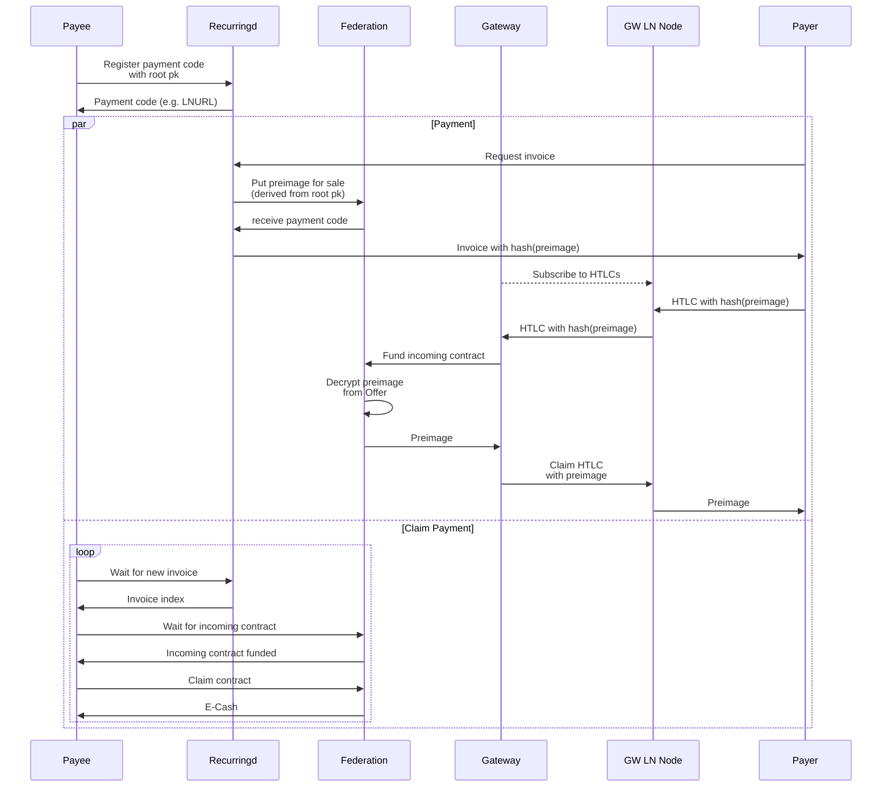

# Recurringd

`recurringd` is a service that allows Fedimint users to receive recurring payments. For now only LNURL is supported, but BOLT12 support is planned.
The service is designed to run independently from guardians and gateways, but obviously can be colocated with any of these.
The operator of the service is trusted to provide the correct invoice to the requester, but does not take custody of the funds when the invoice is paid.

The basic flow is as follows:

1. User registers a payment code by supplying a root public key and receives a payment code, e.g. a LNURL
2. User publishes the payment code
3. Whenever a payer wants to pay the user, the payer requests an invoice from the service
4. The service generates an invoice with the federation locked to a child key derived from the root public key and returns it to the payer
5. The payer pays the invoice
6. Once the user comes online they will check in with `recurringd` and claim all payments received in the meantime

Note that once the invoice is generated `recurringd` will not be able to claim the funds for itself, the worst it can do is withhold the fact that the user has received funds (and even that could be fixed easily).
The user can be offline for an arbitrarily long time without endangering access to their funds.

For more details see the [sequence diagram](#sequence-diagram) below.

## Command line options

```text
Usage: fedimint-recurringd [OPTIONS] --api-address <API_ADDRESS> --bearer-token <BEARER_TOKEN> --data-dir <DATA_DIR>

Options:
      --bind-address <BIND_ADDRESS>  [env: FM_RECURRING_BIND_ADDRESS=] [default: 127.0.0.1:8176]
      --api-address <API_ADDRESS>    [env: FM_RECURRING_API_ADDRESS=]
      --bearer-token <BEARER_TOKEN>  [env: FM_RECURRING_API_BEARER_TOKEN=]
      --data-dir <DATA_DIR>          [env: FM_RECURRING_DATA_DIR=]
  -h, --help                         Print help
```

## Sequence Diagram


